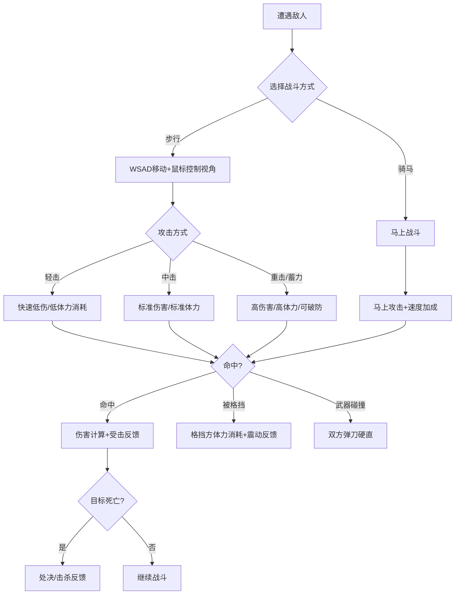

# 个人战斗系统

## 设计目标

> 对标《骑马与砍杀》：四方向攻击由鼠标控制，砍到肉和砍到空气有质的区别。玩家的个人操作水平必须显著影响战斗结果。

## 系统概述

玩家以第三人称视角亲自操控角色进行战斗。核心交互为M&B式的方向攻击系统——鼠标移动方向决定攻击方向，而非按键。包含：四方向砍杀、格挡（方向匹配）、盾防、骑砍、连招、受击反馈。此系统也适用于军团战斗中玩家亲自战斗的场景。

## 核心机制

### 3.1 四方向攻击系统（M&B式）

#### 攻击方向

```
鼠标左键 + 移动方向 = 攻击方向

鼠标左移 → 左砍（水平左挥）
鼠标右移 → 右砍（水平右挥）
鼠标上移 → 上劈（从上到下）
鼠标下移 → 下刺（直线前刺）

武器类型限制：
  剑：左砍/右砍/上劈/下刺 —— 四方向全支持
  刀：左砍/右砍/上劈 —— 侧重砍击，刺击弱
  戟/戈：上劈/下刺 —— 长杆挥击+钩拉
  矛/枪：下刺 —— 仅支持刺击
  弓/弩：瞄准射击模式，无方向区分
  盾：持盾时仅支持 右砍/刺击
  长杆在马下：上劈/下刺
```

#### 攻击蓄力

```
攻击分为三段蓄力：

轻击（即时）：点击即放，伤害80%，速度最快
中击（0.3秒蓄力）：伤害100%，速度正常
重击（0.6秒蓄力）：伤害130%，速度慢，可破防

蓄力中可被攻击打断。蓄力完成瞬间有短暂的前摇锁定。
```

#### 攻击连招

```
基础连招链：
  轻 → 轻 → 重（终结技，伤害150%）
  轻 → 重（二连击，重击伤害120%）
  重 → 重（双重重击，第二击伤害140%，但中间有破绽）
  刺 → 劈 → 砍（三方向变化，混乱对手格挡）

武器专属连招：
  剑：左砍→右砍→刺（剑花三连）
  刀：右砍→上劈→右砍（刀势三连）
  戟：上劈→横扫→下刺（长杆三连）
  双持：左砍→右砍→左砍（六连高速打击）
```

### 3.2 格挡与防御

#### 方向匹配格挡

```
格挡（右键）需要方向匹配：

攻击来自右侧 → 格挡方向必须右侧 → 成功格挡
攻击来自上方 → 格挡方向必须上方 → 成功格挡

非方向匹配格挡 → 格挡失败，受到全额伤害

格挡成功：
  ├── 普通格挡：受到10%伤害（震动伤害）
  ├── 完美格挡（攻击到达前0.2秒内格挡）：受到0%伤害 + 攻击方硬直
  └── 格挡消耗体力：每次格挡消耗10-25体力（取决于武器重量）

盾防（装备盾牌时）：
  ├── 覆盖左半身+正前方，自动格挡该方向所有攻击
  ├── 盾防体力消耗：每次5-15体力（比武器格挡省力）
  ├── 盾耐久：每格挡消耗耐久（盾有耐久度属性）
  └── 不可格挡：重击/攻城器/骑兵冲锋
```

#### 闪避

```
空格键 + 方向 = 闪避

前后左右四方向闪避：
  后闪：最安全，回避距离短
  侧闪：回避距离中，可接反击
  前闪：最危险，但成功后可背刺

闪避无敌帧：0.15秒（动作中段）
闪避体力消耗：20体力/次
负重影响：负重>50% → 闪避距离-30%
```

### 3.3 骑砍系统

#### 马上战斗

```
骑乘状态下的攻击变化：

速度加成伤害（M&B核心机制）：
  马上伤害 = 基础伤害 × (1 + 马速/100)
  静止：1.0x
  慢走(马速~30)：1.3x
  快走(马速~60)：1.6x
  疾驰(马速~100)：2.0x
  极限冲刺(马速~150)：2.5x

马上攻击限制：
  仅支持右砍和左砍（无法上劈/下刺）
  长枪特殊：疾驰时自动架枪（骑枪冲刺模式）
  弓/弩可在马上使用（精度-30%，可升级骑射技能降低惩罚）

骑枪冲刺（矛/枪在马上疾驰）：
  自动进入架枪姿态
  碰到敌人即触发穿刺伤害
  伤害 = 武器伤害 × 3.5 + 马速/10 × 武勇
  可一击秒杀普通士兵
  冲刺后需重新加速
```

#### 马匹属性

| 属性 | 说明 | 范围 |
|------|------|------|
| 速度 | 最大跑速 | 80-150 |
| 耐力 | 疾驰持续时间 | 100-300 |
| 生命 | 马匹HP | 200-800 |
| 胆量 | 面对危险的反应 | 20-100 |
| 转弯 | 高速转弯半径 | 30-70 |
| 护甲 | 马甲减伤 | 0-40% |

#### 马匹受惊

```
胆量判定（遇到以下情况时）：
  象兵/骆驼 → 胆量-30
  火 → 胆量-40
  巨大噪音(投石) → 胆量-25
  被箭射中 → 胆量-10/每次

胆量归零 → 马匹受惊：
  ├── 玩家被甩下马（落地伤害+短暂硬直）
  ├── 马匹原地乱窜（不可骑乘，持续5-15秒）
  └── 马匹逃跑（需要重新追回）
```

### 3.4 体力系统

```
最大体力：100（基础）+ 20（武勇≥60）+ 10（技能节点）

体力消耗：
  轻击：-8
  中击：-12
  重击：-20
  格挡(武器)：-15
  格挡(盾)：-8
  闪避：-20
  冲刺跑：-5/秒
  跳跃：-10
  马上攻击：体力消耗×0.7（骑马省力）

体力恢复：
  静止不动：+8/秒
  慢走：+3/秒
  格挡中：+2/秒（恢复极慢）
  攻击动作中：0（不恢复）

体力<30 → 攻击速度-15%，伤害-10%
体力<10 → 攻击速度-30%，伤害-25%，失去闪避能力
体力=0  → 无法攻击/闪避，只能缓慢移动
```

### 3.5 武器碰撞与手感

#### 命中检测

```
武器命中判定：
  武器碰撞盒(Skeletal Mesh Physics Asset) VS 目标受击盒

碰撞分级：
  刀身命中 → 全额伤害 + 血溅
  刀尖命中 → 115%伤害（尖端速度最快）
  刀柄命中 → 40%伤害（距离太近时发生）

武器碰撞（刀刃互撞）：
  两把武器碰撞盒相交 → 触发武器碰撞
  ├── 重武器撞轻武器 → 轻武器弹开（硬直）
  ├── 同重量级 → 双方弹开（均硬直）
  └── 刺击 vs 砍击 → 刺击穿透（刺击方有利）
```

#### 受击反馈

```
受击者反馈（分层）：
  ├── 视觉：
  │   ├── 血溅粒子（方向=攻击方向，大小=伤害量）
  │   ├── 屏幕边缘泛红（受重伤时）
  │   ├── 伤害数字飘出（可在设置关闭）
  │   └── 角色硬直动画（轻/中/重三级）
  ├── 音频：
  │   ├── 砍中肉体：沉闷声
  │   ├── 砍中盔甲：金属撞击声
  │   ├── 砍中盾牌：木/金属撞击声
  │   └── 致命一击：特殊音效+短暂慢镜
  └── 触觉（手柄）：
      ├── 轻击命中：轻微震动
      ├── 重击命中：强震动
      └── 受击：强震动+方向提示

攻击者反馈：
  ├── 命中确认：轻微震动+音效
  ├── 格挡反馈：明显的金属撞击感（震动+音效）
  └── 击杀反馈：短暂慢镜(0.3秒)+特殊音效
```

#### 手感对比标尺

| 维度 | 本作目标 | M&B2参考 | 实现方式 |
|------|---------|---------|---------|
| 攻击重量感 | 中→重 | 重 | 前摇动画+镜头微移 |
| 格挡反馈 | 清晰金属感 | 清晰 | 震动+音效+粒子 |
| 移动响应 | 灵敏但有惯性 | 有惯性 | 转身速度受负重影响 |
| 武器碰撞 | 有弹刀 | 有弹刀 | 物理碰撞+材质检测 |
| 命中停顿 | 短暂(0.05s) | 有 | Hit Stop机制 |
| 镜头语言 | 击杀慢镜 | 无 | 致命一击0.3s慢镜 |

### 3.6 部位伤害与处决

#### 部位伤害倍率

| 部位 | 倍率 | 特殊效果 |
|------|------|---------|
| 头部 | 2.0x | 概率触发眩晕(视野模糊2秒) |
| 颈部 | 2.5x | 致命一击概率+50% |
| 躯干 | 1.0x | 正常 |
| 手臂 | 0.7x | 概率触发缴械(武器掉落) |
| 腿部 | 0.6x | 概率触发减速(移速-30%，5秒) |

#### 处决系统

```
触发条件：
  目标生命<15% + 玩家使用重击 + 命中躯干/头部

处决动画（每种武器类型专属）：
  剑：刺穿心脏/割喉
  刀：斩首/腰斩
  戟：钩倒后刺击/劈头
  矛：挑飞/贯胸
  弓：远距离爆头（特殊镜头）

处决效果：
  ├── 无视剩余生命直接击杀
  ├── 周围敌军士气-5
  ├── 玩家获得短暂无敌(1秒)
  └── 可被其他敌人攻击打断
```

## 玩家流程



## 操作映射

| 操作 | 键鼠 | 手柄 |
|------|------|------|
| 移动 | WASD | 左摇杆 |
| 视角 | 鼠标 | 右摇杆 |
| 攻击 | 鼠标左键 | RT |
| 格挡 | 鼠标右键 | LT |
| 闪避 | 空格+方向 | A+左摇杆方向 |
| 跳跃 | 空格(无方向) | A(无方向) |
| 切换武器 | 滚轮 | 十字键左/右 |
| 使用道具 | 1-4数字键 | 十字键上/下 |
| 互动/拾取 | F | X |
| 骑乘/下马 | E | Y |
| 锁定目标 | 鼠标中键 | 右摇杆按下 |
| 冲刺(跑步) | Shift | 左摇杆按下 |

## 与其他系统的交互

| 关联系统 | 交互方式 | 影响 |
|---------|---------|------|
| 角色属性 | 武勇属性直接影响伤害和体力上限 | 武勇越高战斗越强 |
| 武器装备 | 武器类型决定可用攻击方向和连招 | 武器决定战斗风格 |
| 军团指挥 | 玩家在军团战中可亲自战斗 | 个人战力影响军团士气 |
| 单挑系统 | 触发单挑后切换到1v1模式 | 个人战斗能力=单挑胜负关键 |
| 技能树 | 战斗系技能解锁新连招/增强伤害 | 技能深化战斗玩法 |

## 数值范围

| 参数 | 最小值 | 默认值 | 最大值 | 说明 |
|------|--------|--------|--------|------|
| 武器基础伤害 | 15(匕首) | 35-65 | 120(顶级名剑) | 不含修正 |
| 武勇伤害修正 | +0%/每点 | +1.5%/每点 | +180%(120武勇) | 线性 |
| 攻击速度(轻击) | 0.2s | 0.4s | 0.8s | 武器越重越慢 |
| 闪避无敌帧 | 0.05s | 0.15s | 0.25s | 技能可延长 |
| 处决触发阈值 | 5% | 15% | 25% | 技能可提高 |

## 变更日志

| 版本 | 日期 | 变更内容 | 作者 |
|------|------|---------|------|
| v1.0 | 2026-07-15 | 初稿，M&B式四方向战斗完整设计 | 策划-战斗 |
