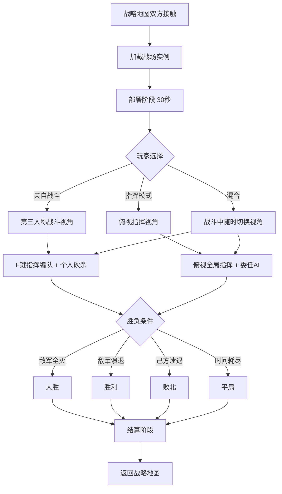

# 军团指挥系统

## 设计目标

> 对标《骑马与砍杀2》的指挥UI，简化操作但保留深度。让玩家既能亲自冲锋陷阵，又能俯视全局运筹帷幄。高低差、地形、阵型相克——高手和新手的指挥决策有显著差异。

## 系统概述

军团战斗时，玩家可编组部队（步兵/弓兵/骑兵/器械），通过F功能键指令系统下达命令。支持两种视角随时切换：第三人称亲自战斗和俯视指挥视角。部队按士气、阵型、地形、兵力对比等因素自主战斗，玩家的指挥决定胜负上限。

## 核心机制

### 3.1 部队编组

#### 编组规则

```
军团最多分为 8 个编队（F1-F8）

默认编组（按兵种自动分组）：
  F1：重步兵（主战步兵）
  F2：轻步兵（游击/山地部队）
  F3：弓兵（远程火力）
  F4：弩兵（破甲远程）
  F5：重骑兵（冲锋主力）
  F6：轻骑兵（侦察/骚扰/追击）
  F7：器械（弩车/投石机）
  F8：亲卫队（不委任AI，仅跟随玩家）

玩家可手动重新编组：
  拆分：将一个编队按比例拆分为两组
  合并：将两个编队合并
  混编：将不同兵种放在同一编队（如枪兵+弓兵混合方阵）
```

#### 编队规模与统率

```
每个编队的最大人数受统率属性限制：

基础编队上限：50人
统率修正：每点统率 +5人
技能修正：统帅系技能节点可增加上限

统率100 + 相关技能全满 → 每编队上限 600人 × 8编队 = 4800人上限
统率50（普通）→ 每编队上限 300人 × 8编队 = 2400人上限

超过编队上限 → 超出部分士气-5%/每10人超出
```

### 3.2 指挥指令系统（F键体系）

#### 指令总览

```
F1 - 移动指令
  ├── F1→F1：移动到指定位置（默认行军速度）
  ├── F1→F2：急行军到指定位置（双倍速度，到达时体力-20%）
  ├── F1→F3：推进（缓慢前进，保持阵型，遭遇敌人自动交战）
  ├── F1→F4：跟随（跟随指定友方部队）
  └── F1→F5：撤退（有序后撤至指定位置，士气-5）

F2 - 阵型指令
  ├── F2→F1：方阵（标准攻守平衡）
  ├── F2→F2：圆阵（360°防御，移速-50%）
  ├── F2→F3：锥阵（攻击阵型，正面冲击力+50%，侧翼脆弱）
  ├── F2→F4：鹤翼阵（两翼包抄，中央薄弱）
  ├── F2→F5：鱼鳞阵（层层防御，一层被破→二层顶上）
  ├── F2→F6：长蛇阵（行军阵型，移速+30%，但战斗极弱）
  ├── F2→F7：雁行阵（V字阵型，中央火力集中，弓弩专用）
  └── F2→F8：偃月阵（弧线包围，需兵力优势）

F3 - 射击指令（仅远程编队）
  ├── F3→F1：自由射击（各自瞄准，射速快）
  ├── F3→F2：齐射（统一发射，伤害集中，有装填间隙）
  ├── F3→F3：抛射（高抛物线，射程+20%，精度-30%，越过友军）
  ├── F3→F4：抵近射击（射程-30%但伤害+50%，近距离用）
  └── F3→F5：停射（节省弹药）

F4 - 武器/姿态
  ├── F4→F1：近战模式（收起远程武器，切换近战）
  ├── F4→F2：远程模式（收起近战武器，切换远程）
  ├── F4→F3：盾墙（举起盾牌，正面防御+50%，移速-60%）
  ├── F4→F4：投掷（投掷标枪/飞斧，一次性高伤害）
  ├── F4→F5：架枪（长枪兵蹲下架枪，反骑兵冲锋）
  └── F4→F6：自由姿态（AI自行判断）

F5 - 战术指令
  ├── F5→F1：冲锋（全速冲向敌人，士气+10但阵型散乱）
  ├── F5→F2：稳步推进（保持阵型缓慢接近，士气+5）
  ├── F5→F3：原地驻守（死守当前位置，士气-5但防御+20%）
  ├── F5→F4：骚扰（骑射/轻骑打了就跑）
  ├── F5→F5：包围（尝试绕到敌军侧后，需速度优势）
  └── F5→F6：诈败/诱敌（假装撤退，引诱敌军追击→伏击）

F6 - 委任
  ├── F6→F1：委任副将指挥当前编队（AI接管）
  ├── F6→F2：委任全军（所有编队交给AI，玩家只亲自战斗）
  └── F6→F3：取消委任（收回指挥权）
```

#### 指令响应

```
常规指令响应时间：
  训练度≥80 → 立即响应
  训练度60-79 → 延迟2-3秒
  训练度40-59 → 延迟4-6秒
  训练度<40 → 延迟7-10秒，可能误解指令(概率10%)

距离影响：距离统帅越远，响应延迟+1-3秒
混战中指令：正在交战的部队响应延迟×2
```

### 3.3 阵型系统

#### 十大阵型详解

| 阵型 | 攻击 | 防御 | 移速 | 侧翼防护 | 适用场景 | 克制 | 被克制 |
|------|------|------|------|---------|---------|------|--------|
| **方阵** | 中 | 中 | 中 | 中 | 通用/攻城 | 无 | 无 |
| **圆阵** | 低 | 极高 | 极低 | 完美 | 被包围/防守 | 骑兵冲锋 | 弓弩远射 |
| **锥阵** | 极高 | 低 | 高 | 弱 | 突破/冲锋 | 方阵 | 鹤翼 |
| **鹤翼阵** | 中 | 中 | 中 | 极强 | 包围敌军 | 锥阵/方阵 | 圆阵 |
| **鱼鳞阵** | 低→中 | 极高 | 低 | 中 | 死守/拖延 | 持续消耗战 | 包围 |
| **长蛇阵** | 低 | 低 | 极高 | 极弱 | 行军/追击 | 无 | 任何攻击阵 |
| **雁行阵** | 极高(远程) | 低 | 中 | 弱 | 远程集火 | 步兵方阵 | 骑兵 |
| **偃月阵** | 高 | 中 | 中 | 强 | 优势兵力包围 | 圆阵 | 锥阵(被突破) |
| **锋矢阵** | 极高(正面) | 极低(侧面) | 高 | 极弱 | 斩首/突破 | 方阵(正面) | 鹤翼(侧面) |
| **车阵** | 低 | 极高 | 0 | 完美 | 野外防守 | 骑兵 | 火攻+长期围困 |

#### 阵型变换

```
变阵时间：
  50人编队：5-10秒
  200人编队：15-25秒
  500人编队：30-45秒
  1000人编队：60-90秒

变阵期间：
  ├── 防御-30%（阵型散乱）
  ├── 无法执行其他指令
  ├── 被攻击→变阵被打断→混乱状态(30秒内无法再变阵)
  └── 统率属性减少变阵时间：每10点统率-5%变阵时间

快速变阵（统帅系技能Lv4解锁）：
  变阵时间-50%
  变阵中防御不减
```

### 3.4 兵种相克

```
基础相克关系：

重步兵 → 克轻步兵/克枪兵正面
轻步兵 → 克弓兵(近身后)
弓兵   → 克轻装单位/克无盾单位
弩兵   → 克重甲/克骑兵(破甲)
重骑兵 → 克步兵(冲锋)/克弓兵
轻骑兵 → 克弓兵/克溃逃追兵/克弩兵(速度)
枪兵   → 克骑兵(架枪)/克战车
战车   → 克步兵(冲击)/克轻骑兵
器械   → 克建筑/克密集阵型

相克伤害修正：
  优势：伤害+30%
  劣势：伤害-20%
  严重劣势：伤害-40%（如轻步兵正面vs重骑兵冲锋）
```

### 3.5 地形对军团的影响

| 地形 | 步兵 | 骑兵 | 弓兵射程 | 弩兵射程 | 移速 | 阵型效果 |
|------|------|------|---------|---------|------|---------|
| **平原** | 正常 | 极佳(+20%冲锋) | 正常 | 正常 | 100% | 正常 |
| **丘陵** | 正常 | 正常 | +10% | +10% | 85% | 提升弓兵射界 |
| **高地** | +15%冲锋 | -20%速度 | +25%射程 | +20%射程 | 70% | 占高地=防御优势 |
| **森林** | 正常 | -40%速度 | -50%射程 | -40%射程 | 60% | 方阵难展开 |
| **沼泽** | -30%速度 | 几乎不可通行 | -20%射程 | -20%射程 | 35% | 重甲可能陷住 |
| **河岸/渡口** | -20%攻击 | -40%冲锋 | -30%精度 | -30%精度 | 30% | 攻方极不利 |
| **山地** | +20%伏击 | 几乎不可通行 | +20%射程 | +20%射程 | 55% | 弓弩优势地形 |
| **雪地** | -10%速度 | -20%速度 | -10%精度 | -10%精度 | 50% | 非耐寒部队持续士气下降 |
| **沙漠** | -10%速度 | -10%速度 | 正常 | 正常 | 70% | 体力消耗×2(夏) |
| **城内/街道** | -30%展开 | 无法冲锋 | -40%射程 | -30%射程 | 50% | 大编队无法展开 |

### 3.6 AI副将系统

#### 副将委任

```
可任命副将指挥单个或多个编队：

副将选择条件：
  必须是军团中的武将
  副将统率影响其指挥能力

副将AI行为（由副将性格决定）：
  激进型(白起)：主动进攻，偏好锥阵/锋矢阵
  稳健型(廉颇)：固守待机，偏好方阵/圆阵/鱼鳞阵
  灵活型(孙膑)：策略多变，偏好鹤翼/雁行/偃月阵
  骑兵型(赵奢)：偏好骑兵冲锋/骚扰战术

AI指挥质量 = 副将统率 × 0.7 + 智略 × 0.3
```

#### 全军委任

```
F6→F2 将全军指挥权交给AI（玩家只亲自战斗）：

全军AI策略：
  ├── 兵力评估（敌我人数/质量对比）
  ├── 地形利用（自动占高地/避开不利地形）
  ├── 阵型选择（根据敌阵选择克制阵型）
  ├── 时机判断（何时冲锋/何时撤退）
  └── 多线协调（多个编队协同作战）

AI难度等级：
  简单：反应慢，策略简单
  普通：标准策略
  困难：积极利用地形和阵型相克
  极难：接近人类高手的战术水平
```

## 战斗进入流程



## 操作映射（指挥模式）

| 操作 | 键鼠 | 功能 |
|------|------|------|
| 俯视/切换 | Tab | 切换第三人称←→俯视指挥 |
| 选择编队 | 1-8 | 选择F1-F8编队 |
| 全选 | Ctrl+A | 选择所有编队 |
| 框选 | 鼠标左键拖拽 | 框选多个编队 |
| 移动/指令 | 鼠标右键 | 对选中编队下达移动/攻击指令 |
| F指令菜单 | F1-F6 | 打开功能子菜单 |
| 编队面板 | 长按Alt | 显示编队状态面板 |
| 小地图 | M | 战场小地图 |
| 暂停(慢动作) | Space | 时间流速×0.1（仅单人模式） |

## 与其他系统的交互

| 关联系统 | 交互方式 | 影响 |
|---------|---------|------|
| 个人战斗 | 玩家可随时切换亲自战斗 | 个人战力影响士气 |
| 士气系统 | 阵型/指令/战况影响士气 | 士气决定部队持久力 |
| 兵种数据 | 兵种属性决定编队战斗力 | 数据=战斗力基础 |
| 地形系统 | 地形修正攻防移速 | 地形决定战术选择 |
| 技能树 | 统帅系技能解锁高级指令 | 统率越高指挥越强 |

## 数值范围

| 参数 | 最小值 | 默认值 | 最大值 | 说明 |
|------|--------|--------|--------|------|
| 编队数量 | 1 | 4 | 8 | F1-F8 |
| 每编队人数上限 | 50 | 200-400 | 600 | 统率决定 |
| 军团总人数上限 | 50 | 800 | 4800 | 全部编队合计 |
| 变阵时间 | 5秒 | 20秒 | 90秒 | 编队规模决定 |
| 指令响应延迟 | 0秒 | 2-5秒 | 10秒 | 训练度决定 |
| AI指挥质量 | 30 | 60 | 95 | 统率+智略 |

## 变更日志

| 版本 | 日期 | 变更内容 | 作者 |
|------|------|---------|------|
| v1.0 | 2026-07-15 | 初稿，M&B式指挥+十大阵法 | 策划-战斗 |
