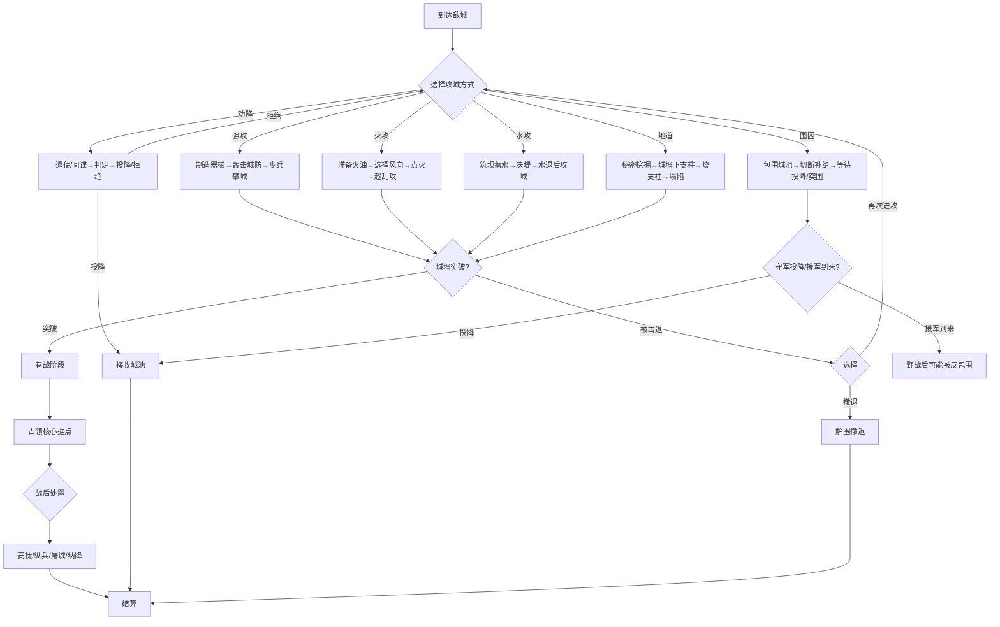

# 攻城战系统

## 设计目标

> 攻城战是战国时代战争的核心——围城、破城、屠城，每一次攻城都应是史诗级的战斗体验。六种攻城方式让玩家根据己方兵力和敌方防御选择最优策略。

## 系统概述

攻城战在独立的战场实例中进行，包含城防体系、攻城器械、攻守双方的不对称对抗。攻城方需突破城防（城墙/箭塔/瓮城）进入城内，守城方依托防御工事以少打多。分六个阶段：围城→准备→进攻→破城→巷战→结算。

## 核心机制

### 3.1 城防体系

#### 城防等级

| 等级 | 名称 | 耐久度 | 防御加成 | 箭塔数量 | 可驻守军 | 需要的攻城方式 | 典型城池 |
|------|------|--------|---------|---------|---------|--------------|---------|
| Lv1 | 木栅土墙 | 5000 | +10% | 0 | 200 | 强攻/火攻 | 村庄 |
| Lv2 | 夯土城墙 | 15000 | +25% | 2 | 500 | 云梯/冲车 | 县城 |
| Lv3 | 砖石城墙 | 30000 | +40% | 4 | 1500 | 云梯+冲车+投石 | 郡城 |
| Lv4 | 重砖城墙+瓮城 | 60000 | +55% | 8 | 5000 | 多手段综合 | 都城 |
| Lv5 | 三重城墙 | 120000 | +70% | 16 | 15000 | 长期围困+全面进攻 | 超级要塞(函谷关) |

#### 城防设施

| 设施 | 功能 | 耐久 | 可被破坏方式 |
|------|------|------|-------------|
| 箭塔 | 自动射击范围内敌人，每塔10名弓弩手 | 2000 | 投石机/冲车/火攻 |
| 城门 | 进出口，被破坏后可突入 | 5000-15000 | 冲车/破门锤 |
| 城墙 | 阻挡移动，守方高处射击 | 按等级 | 投石机/地道 |
| 瓮城 | 城门内的第二道防线（诱敌入瓮） | 20000 | 同上 |
| 护城河 | 阻挡步兵/器械靠近城墙 | 不可破坏 | 填河(需要时间)/过桥 |
| 马面(凸出墙台) | 城墙上凸出平台，侧面射杀攀城者 | 1000/个 | 投石机 |
| 女墙(垛口) | 守方掩体，守方弓弩防御+20% | 500/段 | 投石机 |
| 吊桥 | 跨护城河的桥 | 2000 | 不可破坏(可被内应放下) |

### 3.2 攻城器械

#### 进攻器械

| 器械 | 制造时间 | 需要木材 | 需要精铁 | 操作人数 | 耐久 | 功能 |
|------|---------|---------|---------|---------|------|------|
| 云梯 | 4小时 | 20石 | 2石 | 4人抬 | 1000 | 步兵攀登城墙 |
| 冲车(破门锤) | 6小时 | 30石 | 10石 | 6人推 | 3000 | 撞击城门/城墙 |
| 投石机 | 12小时 | 50石 | 15石 | 8人操作 | 1500 | 远程投石破坏城墙/箭塔 |
| 井阑(移动箭塔) | 8小时 | 40石 | 5石 | 10人推 | 2000 | 攻城方弓弩手高台射击 |
| 攻城塔 | 16小时 | 80石 | 20石 | 12人推 | 5000 | 移动塔楼，直接对接城墙 |
| 弩炮 | 4小时 | 15石 | 8石 | 3人操作 | 800 | 精准破坏城防设施 |
| 地道支架 | 8小时 | 30石 | 0 | 20人挖掘 | — | 挖地道至城墙下方→放火烧支架→城墙塌陷 |

#### 守城器械

| 器械 | 功能 |
|------|------|
| 滚木/礌石 | 从城墙上推下，杀伤攀城敌军 |
| 金汁(煮沸粪水) | 泼洒攀城敌军，伤害+感染debuff |
| 狼牙拍 | 大型钉板拍打云梯上的敌军 |
| 夜叉擂 | 带刺滚筒沿城墙滚下 |
| 弩台 | 加强版箭塔，射程+30% |
| 塞门刀车 | 城门被破后推入堵塞，杀伤涌入敌军 |

### 3.3 六种攻城战术

#### 1. 强攻（正面攻城）

```
适用：兵力优势3:1以上
过程：
  ├── 投石机/弩炮先轰击城墙和箭塔（破坏城防）
  ├── 弓弩手在井阑上压制城头守军
  ├── 步兵推云梯/攻城塔接近城墙→攀城
  └── 冲车撞击城门→破门后骑兵冲入

优势：速度最快
劣势：伤亡最大（攻方:守方伤亡比≈3:1到5:1）
攻城方攻击-20%（守方高处优势）
```

#### 2. 围困（长期围城）

```
适用：时间充裕/守军粮少
过程：
  ├── 包围城池，切断所有补给线
  ├── 守军每日消耗粮食
  ├── 粮食耗尽→守军士气-5/日
  └── 士气归零→开城投降/内部叛乱

围困时间：
  县城存粮：30-60天
  郡城存粮：60-120天
  都城存粮：120-240天

围困方每日消耗：军粮 × 军团人数
风险：敌方援军可能到达→解围/反包围
```

#### 3. 火攻

```
适用：木结构为主的城防/风向有利
过程：
  ├── 准备火油/柴草
  ├── 火箭/投石(火油罐)点燃木栅/箭塔/城门
  ├── 火势蔓延→守军混乱→士气大降
  └── 趁乱攻城

火攻效果：
  木栅土墙(Lv1)：极有效，120%伤害
  夯土城墙(Lv2)：有效(烧城门/箭塔)，80%伤害
  砖石城墙(Lv3+)：几乎无效，仅烧城楼

风向影响：
  顺风→火势向城内蔓延→守方损失+
  逆风→火势被吹回→自伤风险
```

#### 4. 水攻

```
适用：城池靠近河流/湖泊
过程：
  ├── 筑坝蓄水（需要数天至数周）
  ├── 决堤放水→水淹城墙/灌入城中
  └── 水退后城墙地基松软→易于破坏

水攻效果：
  直接破坏城墙耐久 30-50%
  守军士气-40
  城中平民大量伤亡→仁义声望-100
  可能冲毁城中仓库→战后战利品减少

水攻限制：
  需要地形条件(上游可筑坝)
  需要时间(筑坝7-30天)
  可能伤及己方（如果己方也处于低洼处）
```

#### 5. 地道战

```
适用：城墙坚固，正面难攻
过程：
  ├── 选择隐蔽位置开始挖掘地道
  ├── 地道挖至城墙下方
  ├── 扩大坑道→用木柱支撑
  ├── 放火烧木柱→支柱烧毁→地面塌陷→城墙坍塌
  └── 城墙出现缺口→步兵从缺口冲入

地道进度：
  30人：30天挖到城下
  60人：15天
  100人：10天
  
风险：
  ├── 被守军发现→守军反挖地道→地底遭遇战
  ├── 地下水源→地道被淹
  └── 土质不稳→地道坍塌
```

#### 6. 劝降/反间

```
适用：守军士气低/守将忠诚度低
过程：
  ├── 派遣使者劝降（魅力+信义判定）
  ├── 间谍在城中散布恐慌（降低守军士气/民忠）
  ├── 收买守将（离间计，智略判定）
  └── 守将献城→不战而胜

劝降成功率：
  基础概率：10%
  守军士气<30：+20%
  守将忠诚<50：+30%
  己方兵力优势>5:1：+20%
  己方信义声望>80：+15%
  
劝降失败→下次劝降成功率-50%（守军更加坚定）
```

### 3.4 巷战阶段

```
城门被破或城墙出现缺口后→进入巷战：

攻方目标：
  ├── 占领官衙/王宫（核心据点）
  ├── 占领兵营（消灭有组织抵抗）
  └── 占领仓库（获得战利品）

守方目标：
  ├── 巷战拖延时间（等待援军）
  ├── 逐屋防御（缩小战场，抵消兵力劣势）
  └── 焚毁仓库（不让物资落入敌手）

巷战修正：
  攻方骑兵-40%效能
  守方弓弩+15%（熟悉地形）
  小分队作战（大编队自动拆分为小组）
```

### 3.5 战后处置

```
城破后玩家可选择：

1. 安抚 — 禁止抢劫，维持秩序
   效果：仁义+5，民忠保持，城市功能正常
   代价：士兵士气-10（失去劫掠机会）

2. 纵兵 — 允许士兵劫掠3日
   效果：获得额外战利品(金+物资)，士兵士气+20
   代价：仁义-20，城市人口-30%，建筑损坏，民忠归零

3. 屠城 — 最极端的选择
   效果：武名+30，霸业+20，敌军今后面对你士气-30
   代价：仁义-100，信义-50，城市变为废墟（需重建）

4. 纳降 — 接受守军投降，完整接收城市
   条件：守军主动投降/劝降成功
   效果：仁义+10，城市无损
   代价：投降的守军需要处置（收编/遣散/处决）
```

## 攻城流程



## 数值范围

| 参数 | 最小值 | 默认值 | 最大值 | 说明 |
|------|--------|--------|--------|------|
| 城墙耐久 | 5000(Lv1) | 30000(Lv3) | 120000(Lv5) | — |
| 攻城器械制造时间 | 4小时 | 8-12小时 | 16小时 | 可在战斗前预造 |
| 围城时间 | 15天 | 60天 | 240天 | 守军存粮决定 |
| 攻方伤亡比(强攻) | 2:1 | 3:1 | 5:1+ | 攻方:守方 |
| 劝降基础成功率 | 5% | 10% | 80% | 多因素叠加 |

## 变更日志

| 版本 | 日期 | 变更内容 | 作者 |
|------|------|---------|------|
| v1.0 | 2026-07-15 | 初稿，六种攻城方式完整设计 | 策划-战斗 |
