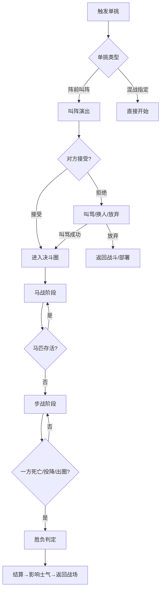

# 单挑系统

## 设计目标

> 还原战国时代"阵前叫阵，双方将领1v1决斗"的历史传统。单挑不仅是武力对决，更是心理博弈——胜负直接影响全军士气。对标《骑马与砍杀》的决斗手感，但增加战国特色：兵器克制、名剑效果、阵前叫骂。

## 系统概述

单挑是两名武将之间的1v1即时战斗，可在战斗前（阵前叫阵）或战斗中（混战中指定敌方武将）触发。单挑使用与个人战斗相同的四方向攻击系统，但增加了特殊规则：限定区域、观战士兵反应、名剑特效。胜负结果影响全军士气和战斗走向。

## 核心机制

### 3.1 单挑触发方式

| 触发方式 | 条件 | 发起方 | 接受方选择 | 拒绝惩罚 |
|---------|------|--------|-----------|---------|
| **阵前叫阵** | 战斗部署阶段 | 任意方武将 | 可接受/拒绝/换人 | 拒绝方士气-15 |
| **阵前叫骂** | 阵前叫阵被拒后 | 叫阵方 | 强制接受（愤怒） | — |
| **混战指定** | 战斗中双方武将接近 | 玩家手动发起 | AI概率接受 | 气势-10 |
| **剧情单挑** | DLC历史战役固定触发 | 系统 | 强制接受 | — |
| **遭遇对决** | 战略地图上两个武将相遇 | 双方都可能 | 可接受/回避 | 回避方在该区域移动力-50%（3天） |
| **复仇单挑** | 被曾击败自己的武将再次挑战 | 上次胜方优先 | 接受概率高 | 拒绝→武名-20 |

### 3.2 叫阵/叫骂系统

#### 阵前叫阵流程

```
战斗部署阶段 → 玩家选择"叫阵"：

1. 选择己方出战武将（默认玩家自己，可选副将）
2. 选择叫阵目标（敌方武将）
3. 叫阵演出：
   ├── 己方武将策马出阵
   ├── 叫阵台词（根据武将性格/关系生成）
   ├── 敌方反应动画
   └── 敌方选择：接受/拒绝/换人/叫骂回应

台词生成参数：
  武将性格：傲慢型(羞辱)/冷静型(挑衅)/豪放型(直爽)
  双方关系：世仇(恶毒)/旧友(叹息)/陌生人(公式化)
  武力差：武力高→傲慢 / 武力低→谨慎
```

#### 叫骂机制

```
对方拒绝单挑后 → 可使用"叫骂"：

叫骂效果（智略+魅力判定）：
  成功：敌方武将怒而出战（强制接受），但愤怒方攻击+10%/防御-15%
  失败：己方显得粗鄙，魅力-2（临时），对方更坚定拒绝
  大成功：敌方士气额外-10（叫骂内容让敌全军动摇）

叫骂成功率 = 30% + 魅力/5 + 智略/10 - 对方统帅/10
```

### 3.3 单挑规则

#### 基本规则

```
单挑区域：战场中央划定的决斗圈（半径30米圆形或矩形）

圈内规则：
  ├── 仅双方武将+最多2匹备用马
  ├── 双方士兵不得进入（进入→该方判负）
  ├── 不得逃跑（离开圈→判负，武名-50）
  └── 无时间限制

战斗规则：
  ├── 使用个人战斗系统（四方向攻击+格挡+闪避）
  ├── 马战→步战自动切换（马被杀死→步战继续）
  ├── 可使用道具(药物/暗器/替换武器)
  └── 直到一方：死亡/投降/失去战斗能力
```

#### 兵器克制

```
单挑中的兵器克制加成（比军团战更显著）：

剑 vs 刀：剑 攻击+10%（灵巧优势）
刀 vs 戟：刀 近身优势+15%（长杆近身弱）
戟 vs 剑：戟 攻击+15%（一寸长一寸强）
矛 vs 剑/刀：矛 刺击伤害+20%（对方难以近身）
空手 vs 持械：空手方闪避+20%但伤害-60%

双方使用同类武器 → 纯看个人武勇和操作
```

#### 名剑特效（单挑中触发）

| 名剑 | 单挑特效 |
|------|---------|
| 太阿 | 攻击+8，每击中3次→下次攻击必暴击 |
| 干将/莫邪 | 双持时攻击速度+25%（双剑流） |
| 鱼肠 | 刺击伤害+35%，适合下刺专精 |
| 巨阙 | 重击可破防+击退（重型压制） |
| 湛卢 | 格挡不需要方向匹配（自动完美格挡）——最顶级 |
| 龙渊 | 连招伤害每段递增10%（最高+50%） |
| 工布 | 削铁如泥→对方武器耐久消耗×3 |
| 胜邪 | 每击杀一个敌人（本场），攻击+2（上限+20） |
| 纯钧 | 尊贵无双→对方攻击-10%（心理压制） |

> 十大名剑各有专属获取任务链。参见装备系统 [117_武器与装备系统.md]

### 3.4 胜负判定与后果

#### 胜负条件

```
胜利条件（满足任一）：
  ├── 对方生命归零→死亡
  ├── 对方投降（对方主动认输）
  ├── 对方失去战斗能力（体力=0或眩晕）
  ├── 对方离开决斗圈
  └── 裁判判定（对方违规）

平局条件：
  ├── 双方同时死亡/倒地
  └── 外部干预（援军冲入打断单挑）
```

#### 胜负后果

| 结果 | 胜方效果 | 败方效果 |
|------|---------|---------|
| **阵前叫阵-胜** | 己方全军士气+30 | 对方全军士气-30 |
| **阵前叫阵-负** | 己方全军士气-30 | 对方全军士气+30 |
| **斩杀敌将** | 士气+15(额外)，武名+20 | 敌军追加士气-15，可能直接溃退 |
| **生擒敌将** | 士气+15，战后可勒索赎金或招募 | 敌军士气-20（失去将领指挥） |
| **混战中单挑胜** | 士气+15，周围敌军士气-10 | — |
| **混战中单挑负** | 士气-15，可能被俘 | — |
| **投降** | 武名+5 | 武名-30（终身耻辱） |
| **拒绝单挑** | — | 己方士气-15，信义-5 |
| **斩将后释放/厚葬** | 仁义+10，武名+10 | 对方派系对你的仇恨减少 |

### 3.5 AI单挑判断

```
AI是否接受单挑的判定权重：

基础接受概率：50%

修正因素：
  武勇差(AI武勇 - 对方武勇) × 2%：（+20则+40%接受率）
  当前士气 > 70：+15%
  当前士气 < 30：-25%
  AI性格：好战型+25%，谨慎型-20%，鲁莽型+40%
  兵力劣势>2:1：-30%（单挑输了就完蛋）
  兵力优势>3:1：+20%（有容错空间）
  曾被对方击败过：-40%
  己方有王牌武将(如白起/廉颇)：+30%（自信）
  
接受概率范围：5% ~ 95%
```

### 3.6 单挑中的QTE事件

```
单挑过程随机触发QTE事件（概率与武勇相关）：

事件类型：
  ├── 兵器脱手（被格挡弹开）→ QTE抢回武器
  ├── 双方武器锁死（角力）→ QTE连打
  ├── 马匹受惊/倒地 → QTE跳马
  ├── 头盔/盾牌被打飞 → 失去头部/盾牌防御
  ├── 地面打滑/泥泞 → QTE保持平衡
  └── 观众呐喊助威 → QTE互动→士气小幅变化

QTE成功：获得短暂优势（对方硬直1秒）
QTE失败：失去优势（己方硬直1秒）
```

## 单挑流程



## 特殊单挑场景

### 历史名将单挑（DLC剧情）

```
DLC历史战役中的固定单挑事件：

长平之战：
  白起 vs 赵括（最终决战）—— 胜方决定历史走向

马陵之战：
  孙膑 vs 庞涓（师兄弟对决）—— 智略替代武勇的"智斗"单挑

邯郸保卫战：
  廉颇 vs 王陵/王龁 —— 老将的尊严之战

这些单挑有专属演出、台词、和分支结果。
```

### 多对多车轮战

```
双方各出3将→轮流单挑→先赢2局者胜

车轮战规则：
  ├── 每局胜方不回复（保持当前血量和体力）
  ├── 可换人（已出战过的不可再出战）
  └── 双方君主/统帅观战（台词和动画）

3v3车轮战胜方：全军士气+50（最高士气加成）
```

## 与其他系统的交互

| 关联系统 | 交互方式 | 影响 |
|---------|---------|------|
| 个人战斗 | 单挑使用相同的战斗操作和伤害模型 | 玩家操作水平直接决定单挑结果 |
| 士气系统 | 单挑胜负影响全军士气 | 士气可能逆转战局 |
| 武器装备 | 名剑和装备在单挑中更显著 | 装备差距可弥补操作差距 |
| 声望系统 | 单挑胜负影响武名/信义/仁义 | 声望影响后续单挑接受率 |
| 人物关系 | 斩杀/释放影响与其他武将的关系 | 影响招募/叛变 |

## 数值范围

| 参数 | 最小值 | 默认值 | 最大值 | 说明 |
|------|--------|--------|--------|------|
| 单挑时间限制 | 无 | 无限 | 300秒 | 超时→平局 |
| 决斗圈半径 | 20m | 30m | 50m | 步兵/骑兵不同 |
| AI接受单挑概率 | 5% | 50% | 95% | 多因素 |
| 单挑胜方士气加成 | +10 | +30 | +50 | 车轮战最高 |
| 武名变化 | -50 | ±20 | +50 | 斩杀/投降 |

## 变更日志

| 版本 | 日期 | 变更内容 | 作者 |
|------|------|---------|------|
| v1.0 | 2026-07-15 | 初稿，含叫阵/兵器克制/名剑特效/QTE | 策划-战斗 |
