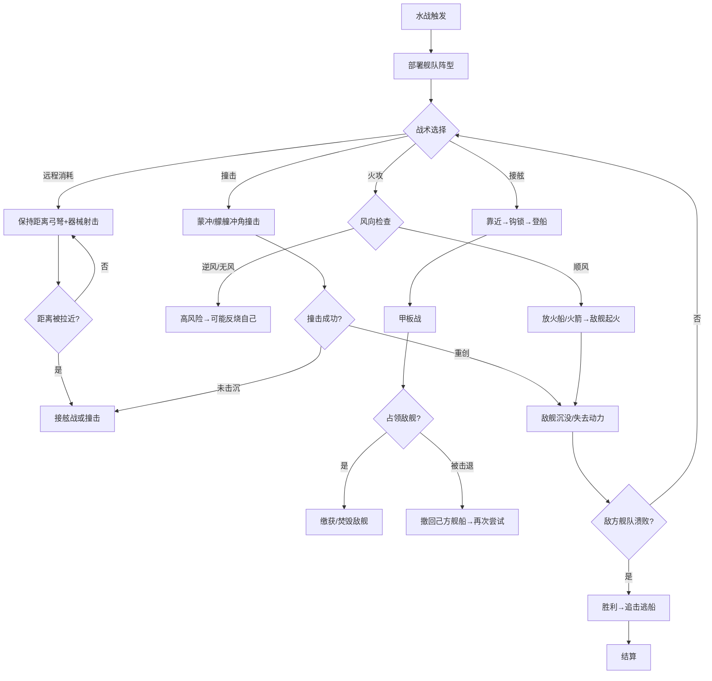

# 水战系统

## 设计目标

> 在长江、黄河、淮河等战国主要水系上，还原接舷战、火攻、撞击等水战核心玩法。楚国水军独步天下，但其他国家也可通过科技发展水军。水战不仅是战斗，也是贸易和战略运输的关键。

## 系统概述

水战是军团战斗在水上的变体，使用舰船替代骑兵，河道/湖泊/近海替代平原/丘陵。战斗模式兼容军团指挥系统（编队→舰船编队），核心差异在于移动基于水流方向、火攻是强力但双刃剑的手段、接舷战后转为步兵甲板战。楚国拥有先天水战优势。

### 3.1 舰船类型

#### 战舰分级

| 等级 | 舰船 | 建造时间 | 建造成本 | 木材 | 容量(人) | 耐久 | 速度 | 转向 | 武器位 | 特殊 |
|------|------|---------|---------|------|---------|------|------|------|--------|------|
| T1 | 走舸(小船) | 3天 | 500金 | 20石 | 20 | 1000 | 快(80) | 极灵活(90) | 0 | 便宜快速 |
| T2 | 蒙冲(中型战船) | 7天 | 2000金 | 60石 | 60 | 3000 | 中(65) | 灵活(70) | 1(弩炮) | 船首冲角 |
| T3 | 斗舰(大型战船) | 14天 | 5000金 | 150石 | 150 | 6000 | 中(60) | 中(55) | 2(弩炮+投石) | 船舷装甲 |
| T4 | 楼船(巨型旗舰) | 30天 | 15000金 | 400石 | 400 | 15000 | 慢(40) | 笨重(30) | 4(全武装) | 多层甲板，水上堡垒 |
| T5 | 艨艟(楚国独有) | 21天 | 8000金 | 200石 | 200 | 8000 | 快(70) | 灵活(65) | 3 | 楚水军精锐，冲撞+火攻双精 |

#### 辅助船只

| 类型 | 功能 | 成本 |
|------|------|------|
| 火船(纵火船) | 装满柴草+火油，顺风撞向敌舰→自爆 | 300金 |
| 运输船 | 运输兵员/物资/马匹 | 800金 |
| 侦察船 | 快速侦察水域 | 200金 |
| 粮船 | 水军粮草补给 | 600金 |

#### 舰船属性详解

| 属性 | 说明 |
|------|------|
| 耐久 | 相当于舰船HP，归零→沉没 |
| 速度 | 基础航速，受水流+风向修正 |
| 转向 | 转向灵活度，影响回避撞击/火船 |
| 接舷防御 | 敌方登船时的防御加成 |
| 船员容量 | 可搭载的士兵数量 |
| 货舱 | 可装载的物资/战利品容量 |
| 吃水深度 | 深水/浅水适航性 |

### 3.2 水战环境因素

#### 水流系统

```
水流方向（从上游→下游）持续影响舰船移动：

顺流而下：航速 +30-50%
逆流而上：航速 -20-40%
横渡水流：航速 -10-20%，船头偏移

水流速度：
  长江干流：快（影响+40%/-35%）
  黄河干流：中（影响+30%/-25%）
  淮河/汉水：中
  湖泊(洞庭/鄱阳)：静水（无影响）
  近海：中等浪涌（影响+15%/-15%，大浪时翻船风险）
```

#### 风向系统

```
风向每90-180秒变化一次：

顺风：航速+20%，火箭射程+30%，火攻伤害+50%
逆风：航速-15%，火箭射程-20%，火攻可能烧自己
侧风：船舶偏移，弓弩精度-20%
无风：航速-10%（需划桨），火攻正常

风向战术价值：
  抢占上风位 → 顺风攻/逆风退
  火攻必须顺风→逆风放火=自杀
```

#### 水域类型

| 水域 | 适合舰船 | 大舰限制 | 特殊 |
|------|---------|---------|------|
| 长江干流 | 全部 | 无 | 楚国主场，航速+10% |
| 黄河干流 | T1-T3 | 楼船吃水受限 | 泥沙淤积风险 |
| 支流小河 | T1-T2 | T3以上无法通行 | — |
| 湖泊 | 全部 | 无 | 静水，接舷战为主 |
| 近海 | T3-T5 | T1-T2浪涌风险 | 风暴/海盗 |
| 沼泽水网 | T1 | T2以上搁浅 | 适合埋伏 |

### 3.3 水战战术

#### 基础战术

| 战术 | 描述 | 优势 | 劣势 |
|------|------|------|------|
| **撞击** | 船首冲角直接撞击敌舰侧面 | 高伤害(蒙冲/艨艟有冲角加成) | 自身也受伤害+可能卡住 |
| **接舷** | 靠近敌舰→搭钩/跳板→步兵登上敌船甲板战 | 发挥步兵战斗力 | 需成功靠近，被远程克制 |
| **火攻** | 火箭/火船点燃敌舰 | 极高伤害+恐慌效果 | 需顺风+可能烧自己+烧毁战利品 |
| **远程消耗** | 弓弩+船上弩炮/投石远程打击 | 安全 | 伤害效率低，弹药有限 |
| **包围** | 多艘船包围单一目标 | 目标无法逃脱 | 己方船只密集→火攻目标大 |
| **断链** | 攻击敌方旗舰→敌方指挥链断裂 | 高效 | 旗舰通常防卫最严密 |

#### 楚国水军专属战术

```
楚国特有科技：

1. 火牛船：载火牛（绑火把的牛）高速冲向敌舰队→混乱
2. 水鬼队：潜水者悄悄爬上敌船→暗杀/破坏/放火
3. 连环计(防御)：己方船只铁索相连→稳定平台→弓弩阵地化
   （但：一旦一艘着火→全连着烧——庞统献给曹操的教训）
4. 长江主场：楚国船只在长江水系航速+15%，船员士气+10
```

#### 编队阵型（水上）

| 阵型 | 形状 | 效果 |
|------|------|------|
| 一字长蛇 | 单列纵队 | 最高航速，弩炮齐射面窄 |
| 横阵 | 单行横队 | 接舷战覆盖面积大，但容易被拦腰撞击 |
| 楔形 | V字箭头 | 旗舰在前突破，撞击专用 |
| 方阵 | 多列方块 | 防御阵型，弓弩全方位覆盖 |
| 圆阵(水上) | 环形防御 | 保护运输船/粮船 |
| 雁行(水上) | 双列V字 | 诱敌深入→两翼包抄 |

### 3.4 接舷战（甲板战）

```
接舷流程：
1. 己方舰船靠近敌舰（距离<5米）
2. 发射钩锁/搭跳板（10-20秒，受敌军干扰）
3. 步兵登上敌船甲板→甲板战斗
4. 占领舵位→控制敌舰（或焚烧/凿沉）

甲板战规则：
  ├── 与陆地个人战斗相同
  ├── 空间狭小（大编队无法展开）
  ├── 摇晃影响：甲板随波浪晃动→弓弩精度-15%
  ├── 落水：被击退到船边→可能落水→需要救援/游泳
  └── 下层甲板：楼船/斗舰有多层→逐层攻占

接舷战优势方：
  楚国：近战步兵+水军经验→接舷伤害+15%
  秦国：铁甲步兵→甲板战防御+20%
  齐国：弓弩手多→接舷前远程消耗大
```

### 3.5 水战指挥

```
水上编队（替代陆地F1-F8编队）：
  F1：前锋舰队（快速船+冲角船）
  F2：主力舰队（斗舰/楼船）
  F3：远程舰队（弓手+船上弩炮）
  F4：火攻队（蒙冲+火船）
  F5：运输队（粮船+运输船）——保卫目标
  F6：接舷队（重步兵满载的蒙冲）

水上特有指令：
  加速（满帆+全力划桨）→速度+50%，船员体力消耗×3
  下锚（停船）→静止，接舷防御+30%
  回避机动 → 速度暂时-20%，闪避撞击概率+40%
  放火船 → 释放无人火船顺流/顺风漂向敌阵
  弃船 → 转移到友方船只，原船自沉
```

### 3.6 水战与陆战衔接

```
水陆联合战役（如即墨之战/鄢郢之战）：

1. 水军封锁河道→切断敌军水上补给
2. 水军运输陆军渡河→战略机动
3. 水军炮轰岸上敌军/城防（弩炮+投石）
4. 陆军配合水军夹击

渡河作战：
  有船：直接渡过（船运容量=舰船容量）
  无船：架浮桥/涉水/游泳
  敌方水军封锁→需要先击败水军或选择夜渡
```

## 水战流程



## 各国水军特色

| 国家 | 水军等级 | 优势 | 劣势 | 专属舰船/战术 |
|------|---------|------|------|-------------|
| **楚** | S | 水战全方面优势，长江主场 | — | 艨艟/火牛船/水鬼队 |
| **齐** | A | 海盐贸易→商船多→水手经验丰富 | 河流作战经验少 | 大型楼船 |
| **吴越(楚)** | A | 沿海+水网地带，造船技术高 | — | 快船+接舷 |
| **秦** | B | 渭水/汉水有内河经验 | 缺乏大海/大江经验 | 运输船多(战略投送) |
| **赵** | C | 黄河渡口争夺经验 | 无舰船传统 | 浮桥+快速渡河 |
| **魏** | C | 黄河/淮河有内河经验 | 无大型战舰 | — |
| **燕** | D | 渤海沿海有点经验 | 大部分领土无水系 | 小渔船改战船 |
| **韩** | D | 无 | 内陆国家 | 无 |

### 3.7 舰船建造与维护

```
舰船建造条件：
  ├── 需要沿海/沿河城池（有船坞建筑）
  ├── 需要大量木材（楚国/巴蜀优势）
  ├── 建造时间较长（战前预造，非战场现造）
  └── 需要工匠（工艺属性影响建造速度和质量）

舰船维护：
  每艘船月维护费 = 建造成本 × 3-5%（船员军饷+维修）
  舰船耐久每月自然损耗 1-3%
  战斗损伤需回船坞修理（免费/加速花费金）
  长期不用→停泊在船坞→维护费减半

可携带舰船数：
  非水军将领：最多5艘
  水军专精将领：最多20艘
  楚国水军将领：最多30艘
```

## 与其他系统的交互

| 关联系统 | 交互方式 | 影响 |
|---------|---------|------|
| 军团指挥 | 水上版编队+F指令 | 共享指挥框架 |
| 攻城系统 | 水军可炮轰岸边城防 | 水陆联合攻城 |
| 贸易系统 | 商船=水战保护/劫掠目标 | 水战保护/威胁商路 |
| 科技系统 | 造船术/水战科技解锁高级舰船 | 科技驱动水军发展 |
| 兵种系统 | 步兵登船→水战步兵（无骑兵） | 骑兵在船上极弱 |

## 数值范围

| 参数 | 最小值 | 默认值 | 最大值 | 说明 |
|------|--------|--------|--------|------|
| 舰船耐久 | 1000(T1) | 6000(T3) | 15000(T4) | — |
| 舰船容量 | 20人 | 150人 | 400人 | 士兵数 |
| 火攻伤害 | 500/秒 | 1000/秒 | 2000/秒 | 对舰船耐久 |
| 接舷登船时间 | 5秒 | 15秒 | 30秒 | 受干扰+ |
| 建造时间 | 3天(T1) | 14天(T3) | 30天(T4) | — |

## 变更日志

| 版本 | 日期 | 变更内容 | 作者 |
|------|------|---------|------|
| v1.0 | 2026-07-15 | 初稿，包含舰船/水流风向/接舷/各国水军 | 策划-战斗 |
