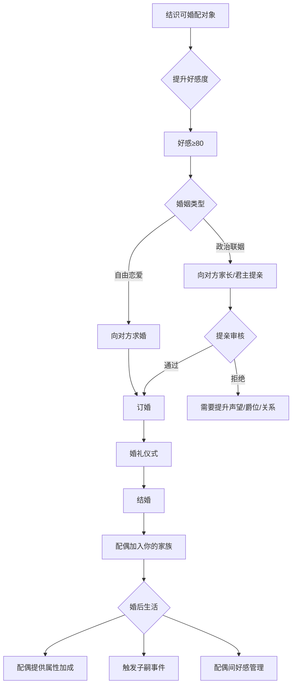

# 婚姻与继承系统

## 设计目标

> 婚姻不只是"找个配偶"——在战国乱世，婚姻是政治、是联盟、是血脉延续。继承系统确保角色死亡不会导致游戏结束，子嗣继承让故事延续。

## 系统概述

玩家可追求婚姻（政治联姻或自由恋爱），配偶提供属性加成、政治同盟和子嗣。角色有自然寿命限制，死亡后由成年的子嗣继承（或指定继承人）。继承系统使得"家族经营"成为长线玩法。

## 第一部分：婚姻系统

### 3.1 婚姻类型

| 类型 | 目的 | 对象 | 效果 | 代价 |
|------|------|------|------|------|
| **政治联姻** | 巩固同盟 | 国君之女/贵族子女 | 两国同盟+20，爵位晋升，嫁妆 | 受制于姻亲国的外交立场 |
| **武将联姻** | 笼络名将 | 武将之女/子 | 该武将忠诚+30，永不叛变 | — |
| **自由恋爱** | 感情 | 任何角色(不限身份) | 配偶好感固定为100，幸福度高 | 无政治收益 |
| **宗室联姻** | 融入王室 | 君主直系子女 | 可能继承该国(配偶为继承人时) | 卷入王室内斗 |

### 3.2 可婚配对象

#### 女性角色（女玩家可追求）

| NPC | 身份 | 属性加成 | 嫁妆/聘礼 | 获取条件 |
|------|------|---------|----------|---------|
| 赵姬 | 赵国宗室女 | 魅力+5 | 战马50匹 | 赵王赏识+魅力≥60 |
| 秦公主 | 秦王之女 | 统率+3,魅力+3 | 秦兵器100件 | 秦爵位≥中卿 |
| 齐商女 | 齐国大商人之女 | 经营+8 | 5000金嫁妆 | 商人出身或经营≥50 |
| 楚贵族女 | 楚国贵族 | 魅力+4,智略+2 | 漆器+珍珠嫁妆 | 楚王/贵族推荐 |
| 名将之女 | 某武将之女 | 武勇+3 | — | 该武将好感≥80 |
| 民间女子 | 平民 | — | — | 自由恋爱，无门槛 |

#### 男性角色（男玩家可追求或女性玩家婚配）

| NPC | 身份 | 属性加成 | 效果 | 获取条件 |
|------|------|---------|------|---------|
| 诸侯之子 | 国君继承人 | 国家继承权 | 该国成为你的盟友 | 极高魅力/声望 |
| 名将之后 | 名将之子 | 武勇+5 | 获得该武将家族支持 | 武名高/信义高 |
| 学者名士 | 学派传人 | 智略+5 | 科技研发+30% | 智略高/加入该学派 |
| 富商之子 | 商业家族 | 经营+5 | 获得商业网络 | 经营高 |

### 3.3 婚姻流程



### 3.4 婚姻效果

```
结婚后：

配偶加成（持续）：
  ├── 基础属性加成（根据配偶类型）+2~8点
  ├── 家庭幸福度BUFF：幸福度>80→全属性+5%
  └── 配偶技能：某些配偶有特殊技能（内政/外交/医术）

政治收益：
  ├── 政治联姻→两国同盟+20（持续到离婚/配偶死亡）
  ├── 联姻国遭受攻击→你可选择参与防御战争
  └── 联姻国扩张→你的影响力随之增长

子嗣系统（见第二部分）

离婚/丧偶：
  ├── 配偶死亡：属性加成消失，子嗣保留
  ├── 离婚（政治联姻）：外交关系-30
  └── 再婚：可以，但需间隔1年
```

---

## 第二部分：继承系统

### 3.5 角色寿命

```
基础寿命：60-75岁（创建角色时随机）

寿命修正：
  武勇≥80：寿命+5（体魄强健）
  多次重伤：寿命-5~15
  有医官照料：寿命+5
  被长期囚禁：寿命-10~20
  中毒/受伤不治：大幅缩短

寿命警告：
  50岁起每年有一定概率出现"健康事件"
  60岁后死亡概率逐年增加
  到达基础寿命上限→高概率自然死亡
```

### 3.6 子嗣系统

#### 生育

```
生育条件：
  ├── 已婚（需有配偶）
  ├── 配偶关系良好（好感≥60）
  └── 时间（结婚1年后概率触发怀孕事件）

孕期：9个月（游戏时间）
生育间隔：至少1年

子女数量：基础2-4个（受幸福度/医官影响）

子女性别：随机（50/50）
多胞胎概率：5%（双胞胎）/ 1%（三胞胎）
```

#### 子女属性

```
子女初始属性 = (父属性 + 母属性) / 2 + 随机(-5~+5) + 天赋修正

天赋修正（随机）：
  平庸(60%概率)：±0
  聪慧(25%概率)：智略/魅力+5
  武勇(10%概率)：武勇+8
  天才(4%概率)：全属性+3
  天选(1%概率)：全属性+8

子女成长阶段：
  ├── 婴儿(0-2岁)：不可互动，需要母亲照料
  ├── 幼儿(3-7岁)：可互动，属性开始显现
  ├── 少年(8-14岁)：可安排教育（私塾/学宫/拜师），属性快速成长
  ├── 青年(15-17岁)：可开始参与简单任务/学习战斗
  └── 成年(18岁+)：可独立行动，可继承，可婚配
```

#### 子女教育

```
教育方式（选择后持续到18岁或切换）：

1. 学宫教育（适合士人/王道路线）
   花费：2000金/年
   效果：智略+魅力成长加速，其他一般

2. 武艺训练（适合游侠/霸道路线）
   花费：1500金/年
   效果：武勇+统率成长加速

3. 商业学徒（适合商道路线）
   花费：1000金/年
   效果：经营成长加速

4. 工坊实践（适合匠道路线）
   花费：800金/年
   效果：工艺成长加速

5. 全才教育（均衡发展）
   花费：3000金/年
   效果：全属性均衡成长，但单项不如专精

6. 自学（不花费）
   效果：随机的属性成长
```

### 3.7 继承规则

```
角色死亡 → 触发继承：

继承顺位：
  1. 成年嫡长子（正妻长子）
  2. 成年嫡子（正妻其他儿子）
  3. 成年庶长子（侧室长子）
  4. 成年庶子
  5. 成年嫡女（无男性继承人时）
  6. 兄弟/侄子
  7. 指定继承人（生前指定，可打破血缘顺序）
  8. 无人继承→游戏结束

继承后：
  ├── 继承人继承：
  │   ├── 封地、爵位（如果爵位可世袭）
  │   ├── 财产的70%（30%为丧葬费+遗产税）
  │   ├── 装备/名剑
  │   ├── 人际关系（部分继承，部分需重新建立）
  │   └── 声望的50%（下一代需要重新证明自己）
  ├── 继承人属性：独立属性（之前已成长）
  └── 继承人年龄：通常在18-40岁之间

继承后的游戏状态：
  ├── 世界时间继续推进（不重置）
  ├── NPC关系部分保留
  ├── 敌对势力可能趁虚而入（新主登基不稳定期）
  └── 封地民忠-10（新人需要时间树立威信）
```

### 3.8 继承策略

```
玩家应有"家族经营"思维：

1. 早婚早育
   角色25-30岁结婚 → 子女在角色50-60岁时已成年
   确保继承时不至于子女太小无法继位

2. 多子多福
   多个子女 = 继承人选多
   但：子女多 → 分家产 → 可能引发兄弟争斗

3. 生前安排
   提前指定继承人（减少继承混乱）
   给非继承子女安排出路（从军/入仕/经商）
   避免"诸子争位"

4. 联姻扩大
   子女联姻 → 扩大家族政治网络
   孙子辈 → 进一步扩大
   三代经营 → 家族势力根深蒂固

5. 养子制度
   无亲生子女时可收养（需仁义≥40）
   养子忠诚度与亲生相同
   有养子→亲生子的继承顺位冲突（部分NPC反对）
```

---

## 家族树UI

```
家族树面板：
  ├── 可视化家族树图
  ├── 每个家族成员的头像+名字+属性概要
  ├── 点击→查看详细信息
  ├── 标记：当前角色(金色框)/继承人(绿色框)/在世/已故
  └── 家族统计：代数/总人数/在世/封地总值

操作：
  ├── 指定继承人（可随时更改）
  ├── 安排子女教育方向
  ├── 安排子女婚姻
  ├── 分封子女（给予部分封地/财产独立成家）
  └── 收养子嗣
```

## 与其他系统的交互

| 关联系统 | 交互方式 | 影响 |
|---------|---------|------|
| 声望系统 | 婚姻影响声望，继承声望折半 | 家族声望积累 |
| NPC关系 | 通过婚姻建立/强化NPC关系 | 姻亲=永久关系 |
| 爵位系统 | 爵位可世袭，配偶影响爵位获取 | 婚姻→政治→爵位 |
| 年龄系统 | 角色年龄决定婚姻/生育/继承时机 | 时间→生命→继承 |

## 变更日志

| 版本 | 日期 | 变更内容 | 作者 |
|------|------|---------|------|
| v1.0 | 2026-07-15 | 初稿，婚姻+子嗣+继承+家族经营 | 策划-角色 |
