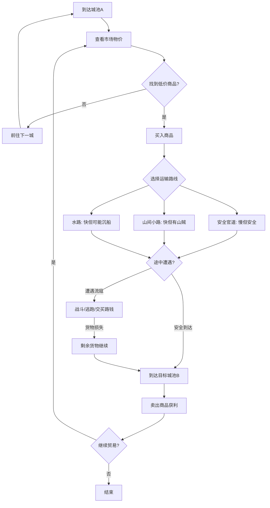

# 贸易系统

## 设计目标

> 对标《大航海时代4》：跨城物价差是贸易玩法的核心驱动力。玩家通过信息差、运输能力和风险判断来获利，而非简单刷钱。

## 系统概述

玩家可在各城池的市场中进行商品买卖。每个城池有独立的物价表，物价受当地产出、季节、战争、灾荒、玩家行为（大量买入/卖出）等因素动态影响。核心玩法是：在产地低价买入→安全运输到高价区→高价卖出赚取差价。

## 核心机制

### 3.1 跨城物价差（大航海时代4核心机制）

#### 物价决定公式

```
城池实际价格 = 基础价格 × 当地供给修正 × 季节修正 × 战争修正 × 事件修正 × 玩家行为修正

基础价格：见 DT_PriceTable（参考200_数据表/230_经济/物价表.csv）
当地供给修正：产地 0.7-0.85x / 普通 0.9-1.1x / 稀缺 1.3-2.0x
季节修正：丰收季 0.7-0.9x / 冬季/灾荒 1.2-1.5x
战争修正：非战区 1.0x / 前线 1.3-1.5x / 围城中 2.0x+
事件修正：商路中断 +0.2x / 大量抛售 -0.3x
玩家行为修正：单次买入>50件该商品→每次再买+5%，累积至+50%上限
```

#### 物价信息获取

| 方式 | 信息精度 | 成本 | 时效 |
|------|---------|------|------|
| 亲自到达该城 | 100%精确 | 时间+旅费 | 即时 |
| 派遣伙计/探子 | 90%精确 | 50-200金/次 | 延迟1-3天 |
| 商队回报 | 85%精确 | 商队运营成本 | 延迟5-10天 |
| 酒馆打听 | 70%精确 | 10-50金 | 延迟3-7天 |
| 间谍网络 | 95%精确 | 间谍维护费 | 即时 |

### 3.2 特产系统

每座城池有其独特产出。特产在产地购买价格最低，运到稀缺区利润最高。

#### 七国特产分布

| 国家 | 主要城池 | 特产 |
|------|---------|------|
| **秦** | 咸阳 | 战马(陇西)、铁器、兽皮、玉器(蓝田) |
| **楚** | 郢都 | 稻米、铜矿(宛城)、漆器、珍珠(会稽)、药材 |
| **齐** | 临淄 | 海盐、丝绸、鱼干、竹简(稷下) |
| **赵** | 邯郸 | 战马(代郡)、铁矿、皮革、精铁 |
| **燕** | 蓟城 | 战马(辽西)、人参、皮毛 |
| **魏** | 大梁 | 粮食(黄淮)、布帛、陶器、池盐(河东) |
| **韩** | 新郑 | 铁器(宜阳)、强弓、劲弩、精铁 |
| **周** | 洛阳 | 青铜器、礼器、古董 |

#### 特产利润梯度

```
同城买卖：基准价 × 0.9（无利润）
邻国产地→邻国稀缺：利润 30-80%
跨国产地→远国稀缺：利润 80-200%
战区急需（兵器/粮食/药材）：利润 150-300%
```

### 3.3 市场供需动态

#### 需求驱动因素

| 因素 | 影响商品 | 需求量变化 |
|------|---------|-----------|
| 战争 | 兵器、战马、粮食、药材、皮革 | +50% ~ +200% |
| 灾荒 | 粮食、药材 | +100% ~ +300% |
| 节日/祭祀 | 丝绸、漆器、玉器、酒 | +30% ~ +80% |
| 工程建设 | 木材、石材、铜、铁 | +40% ~ +100% |
| 人口增长 | 粮食、布帛、海盐 | +10% ~ +30%/年 |

#### 供给影响事件

| 事件 | 影响商品 | 供给量变化 |
|------|---------|-----------|
| 商路被劫 | 途经的所有商品 | -20% ~ -50% |
| 产地丰收 | 当地特产 | +30% ~ +60% |
| 矿脉枯竭 | 矿石类 | -40% ~ -80% |
| 敌军封锁 | 所有进口商品 | -50% ~ -90% |
| 玩家垄断囤货 | 被囤商品 | 价格飙升 |

### 3.4 讨价还价机制

玩家可使用"经营"属性与商人讨价还价。

```
最终成交价 = 标价 × (1 - 还价幅度)

还价幅度 = 经营属性 / 200 + 魅力修正 + 声望修正 + 关系修正

经营属性：0-120，每点增加 0.5% 还价幅度
魅力修正：商人好感度 (好感/100) × 5%
声望修正：信义声望 / 100 × 5%
关系修正：与该城统治者的关系 / 100 × 3%

还价幅度上限：30%（基础）+ 10%（商人出身）= 40%

还价失败惩罚：连续还价失败→商人拒绝交易(冷却24小时)
```

### 3.5 商铺投资（太阁立志传5风格）

玩家可在各城投资商铺，获得被动收入和物价影响力。

| 投资等级 | 费用 | 月收入 | 物价影响力 | 其他收益 |
|---------|------|--------|-----------|---------|
| Lv1 小摊 | 500金 | 30-50金/月 | 无 | — |
| Lv2 店铺 | 2000金 | 100-200金/月 | 该商品±3% | 可委托收购 |
| Lv3 商号 | 8000金 | 400-800金/月 | 该商品±8% | 可囤货操纵 |
| Lv4 商会 | 30000金 | 1500-3000金/月 | 该商品±15% | 垄断可能 |
| Lv5 垄断 | 100000金 | 5000-10000金/月 | 该商品±30% | 全城定价权 |

> 投资等级受经营属性限制：Lv3需经营≥40，Lv4需≥60，Lv5需≥80

## 玩家流程



## 商路系统

### 陆上商路

| 商路名 | 路线 | 特产流向 | 风险 |
|--------|------|---------|------|
| 秦楚商路 | 咸阳→宛城→郢都 | 秦马→楚 / 楚铜→秦 | 中(山路) |
| 中原商路 | 大梁→新郑→洛阳→邯郸 | 粮食/铁器/盐 | 高(战区) |
| 齐赵商路 | 临淄→邯郸→代郡 | 盐/丝绸→赵 / 马→齐 | 中 |
| 燕赵商路 | 蓟城→代郡→邯郸 | 马/皮毛→中原 | 中 |
| 秦蜀商路 | 咸阳→汉中→巴蜀 | 铁器→蜀 / 药材→秦 | 高(栈道) |

### 海上商路

| 商路名 | 路线 | 特产流向 | 风险 |
|--------|------|---------|------|
| 齐楚海路 | 临淄→会稽→南海 | 盐/丝绸→南 / 珍珠→北 | 中(海盗) |
| 渤海商路 | 蓟城→临淄 | 皮毛/人参→齐 / 盐→燕 | 低 |
| 吴越海路 | 会稽→琅琊 | 漆器/珍珠→北 | 中 |

### 商路风险

```
安全商路：遭遇劫掠概率 5-10%
有流寇出没：遭遇劫掠概率 20-40%
战区：遭遇军队拦截概率 30-60%
恶劣天气(海上)：沉船/货物损失概率 10-25%

遭遇后选项：
1. 战斗 → 胜利获得战利品，失败货物全失+被俘
2. 交买路钱 → 损失10-30%货物价值
3. 逃跑 → 概率成功(取决于速度)，失败→损失50%货物
```

## 贸易策略

### 基础跑商策略

| 策略 | 描述 | 适合阶段 |
|------|------|---------|
| 近程倒卖 | 相邻城池间买卖日用品 | 新手期 |
| 特产长途 | 产地低价买入特产→运到远方 | 中期 |
| 战争投机 | 向战区高价出售兵器/粮食/药材 | 高风险高回报 |
| 季节套利 | 秋收买粮→冬季/春荒卖粮 | 稳定收益 |
| 垄断操纵 | 大量囤积某商品→制造稀缺→高价卖出 | 后期（需大量资金） |

### 商人出身优势

```
商人出身获得以下贸易加成：
- 初始资金 5000 金（最高）
- 贸易利润 +25%
- 讨价还价幅度上限 +10%（可达 40%）
- 初始投资等级：已有 Lv1 商铺 × 3（随机城池）
- 专属技能树"经营系"解锁更快
- 可识别"虚假报价"（NPC虚报价格概率-50%）
```

## 与其他系统的交互

| 关联系统 | 交互方式 | 影响 |
|---------|---------|------|
| 商队系统 | 贸易需要组建商队来运输货物 | 商队规模=单次贸易量上限 |
| 战斗系统 | 商路遭遇流寇/敌军→切换战斗 | 个人武力可保卫商队 |
| 货币系统 | 跨国贸易需兑换货币 | 汇率影响实际利润 |
| 国家策略 | 贸易禁令/关税政策影响物价 | 政治影响贸易自由度 |
| 声望系统 | 信义影响交易信用；霸业影响垄断容忍度 | 声望高→更多贸易特权 |

## 数值范围

| 参数 | 最小值 | 默认值 | 最大值 | 说明 |
|------|--------|--------|--------|------|
| 单城物品种类 | 15 | 25 | 40 | 大城市品种更多 |
| 物价刷新周期 | 1天 | 3天 | 7天 | 可配置 |
| 单次最大购买量 | — | 99 | 999 | 受商店库存限制 |
| 商铺库存恢复 | — | 每天+10% | — | 受产地供给影响 |
| 投资回报周期 | — | 6-12个月 | — | 收回投资成本时间 |

## 变更日志

| 版本 | 日期 | 变更内容 | 作者 |
|------|------|---------|------|
| v1.0 | 2026-07-15 | 初稿 | 策划-经济 |
