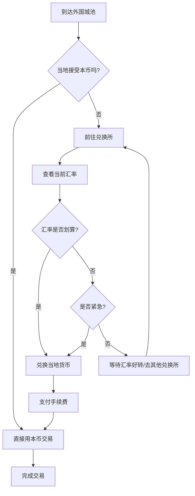

# 货币系统

## 设计目标

> 还原战国时期真实的多种货币并存格局。货币不仅是交易媒介，更是国力的象征——强国货币成为硬通货，弱国货币贬值无人要。

## 系统概述

战国时期各国使用不同形制的货币。玩家在不同国家交易时可能需要兑换当地货币，汇率随国力、战争、经济状况浮动。秦国统一趋势下，半两钱逐渐成为跨区域硬通货。系统使用"基准金"作为底层计价单位（1基准金 = 理论上1文秦半两的购买力）。

## 核心机制

### 3.1 七国货币体系

| 货币名称 | 使用国 | 形制 | 材质 | 初始汇率(对基准金) | 特点 |
|---------|--------|------|------|-------------------|------|
| **秦半两** | 秦 | 圆形方孔钱 | 铜 | 1:1 | 标准化最高，逐渐成为硬通货 |
| **楚蚁鼻钱** | 楚 | 贝形铜币 | 铜 | 1:0.85 | 币值较低，小额交易 |
| **楚郢爰** | 楚 | 金版(方形金块) | 金 | 1:240 | 大宗交易/贮藏用 |
| **齐刀币** | 齐 | 刀形铜币 | 铜 | 1:1.15 | 币值稳定，商业信用好 |
| **赵布币** | 赵 | 铲形铜币 | 铜 | 1:0.95 | 币值中等 |
| **燕明刀** | 燕 | 刀形铜币(小) | 铜 | 1:0.78 | 币值较低 |
| **魏布币** | 魏 | 铲形铜币(大) | 铜 | 1:1.05 | 中原通用性高 |
| **魏圜钱** | 魏 | 圆形圆孔钱 | 铜 | 1:0.98 | 过渡期货币 |
| **韩布币** | 韩 | 铲形铜币(小) | 铜 | 1:0.72 | 币值最低，国力弱 |
| **周室泉** | 周 | 圆形圆孔钱 | 铜 | 1:0.55 | 象征意义 > 实际价值 |

> 玩家UI中统一显示为"基准金"，实际交易时自动换算为当地货币。

### 3.2 货币兑换

#### 兑换所

| 城池等级 | 兑换所数量 | 支持币种 | 兑换手续费 |
|---------|-----------|---------|-----------|
| 都城 | 3-5个 | 全部7国货币 | 2-5% |
| 郡城 | 1-2个 | 5-6种 | 3-8% |
| 县城 | 0-1个 | 3-4种 | 5-12% |
| 关隘/村庄 | 无 | 当地货币+邻国1-2种 | 8-20% |

> 手续费可随经营属性降低：每10点经营减0.5%手续费，最低1%

#### 汇率浮动机制

```
汇率 = 基础汇率 × 国力修正 × 战争修正 × 经济修正 × 投机修正

国力修正：
  强国(秦/齐)：1.0-1.3x（升值）
  弱国(韩/周)：0.5-0.9x（贬值）
  灭国后：货币作废（仅收藏价值）

战争修正：
  战胜国：+10-25%（短期升值）
  战败国：-15-40%（短期贬值）
  被围城中：-30-50%（恐慌抛售）

经济修正：
  丰收年/商路通畅：+5-15%
  灾荒/贸易逆差：-10-30%

投机修正：
  玩家单次兑换>10000金 → 汇率波动±5%
  索罗斯式攻击：连续大量抛售某货币 → 可能触发贬值螺旋
```

#### 汇率套利

玩家可通过汇率差套利（类似现实外汇交易）：

```
三角套利示例：
  持有1000齐刀币
  → 齐刀币→魏布币(汇率1:1.08) → 得1080魏布币
  → 魏布币→秦半两(汇率1:0.95) → 得1026秦半两
  → 秦半两→齐刀币(汇率1:0.87) → 得1179齐刀币
  → 净赚179齐刀币！

但：每次兑换有手续费，且大规模兑换会触发汇率波动
```

### 3.3 货币统一趋势

模拟秦国统一货币的历史进程：

| 阶段 | 触发条件 | 效果 |
|------|---------|------|
| 初期(前260年前) | 游戏开始 | 七国各自货币，汇率浮动 |
| 中期(秦灭2-3国) | 秦灭韩/赵/魏 | 秦半两成为中原主要结算货币，被他国接受概率+40% |
| 后期(秦灭5国+) | 秦只剩1-2个对手 | 秦半两强制流通，其他货币大幅贬值(-60%) |
| 统一后 | 秦灭六国 | 统一货币"秦半两"，其他货币变为收藏品 |

> 如果玩家阻止秦统一，货币格局可维持多元化。

### 3.4 借贷系统

#### 借贷渠道

| 渠道 | 额度上限 | 年利率 | 期限 | 抵押要求 | 违约后果 |
|------|---------|--------|------|---------|---------|
| 钱庄 | 5000金 | 12-18% | 12个月 | 需资产证明 | 没收抵押物+信用降级 |
| 私人放贷 | 20000金 | 24-36% | 6个月 | 需担保人/封地抵押 | 失去封地/被抓捕 |
| 国家借款 | 100000金 | 5-10% | 36个月 | 需有爵位 | 削爵/没收封地 |
| 商人互助 | 5000金 | 8-15% | 12个月 | 需商会成员 | 商会除名 |

#### 信用等级

| 等级 | 名称 | 利率加成 | 额度倍率 | 获取条件 |
|------|------|---------|---------|---------|
| 1 | 无名小卒 | +10% | ×0.5 | 默认 |
| 2 | 有产者 | +5% | ×1.0 | 资产>1000金 |
| 3 | 殷实商人 | +0% | ×1.5 | 资产>5000金+按时还贷3次 |
| 4 | 富甲一方 | -3% | ×2.5 | 资产>20000金+经营≥40 |
| 5 | 信用卓著 | -5% | ×4.0 | 资产>50000金+信义≥60 |
| 6 | 陶朱公 | -10% | ×8.0 | 资产>100000金+信义≥80+经营≥80 |

### 3.5 通货膨胀与紧缩

#### 通胀来源

| 原因 | 影响范围 | 通胀率 |
|------|---------|--------|
| 国家大量铸币 | 该国全境 | +5-30%/年 |
| 战争赔款流入 | 收款国 | +10-25%/年 |
| 灾荒→物资短缺 | 灾荒区域 | +30-80%/年 |
| 玩家大量买入 | 被买商品 | +5-50% |

#### 玩家应对通胀

```
持有实物资产(粮食/铁/马/封地) → 保值
持有现金 → 贬值
跨国分散资产 → 对冲单一货币风险
投资商铺 → 租金随通胀上涨
```

## 玩家流程



## 与其他系统的交互

| 关联系统 | 交互方式 | 影响 |
|---------|---------|------|
| 贸易系统 | 跨国贸易需要关注汇率 | 汇率波动可能吃掉贸易利润 |
| 国家策略 | 国家货币政策/贸易禁令影响汇率 | 政治→经济→贸易 |
| 战争系统 | 战胜/战败影响货币信心 | 军事结果→汇率剧变 |
| 声望系统 | 信用等级与信义声望挂钩 | 声望=借钱能力 |

## 数值范围

| 参数 | 最小值 | 默认值 | 最大值 | 说明 |
|------|--------|--------|--------|------|
| 兑换手续费 | 1% | 5% | 20% | 城池规模+经营属性影响 |
| 汇率日波动 | -5% | ±1% | +5% | 正常波动 |
| 汇率事件波动 | -50% | — | +50% | 灭国/重大事件 |
| 贷款利率 | 5% | 12% | 36% | 最优惠→高利贷 |
| 贷款额度 | 500 | 5000 | 100000 | 渠道决定 |
| 通胀率(正常) | -2% | 0% | +5%/年 | 轻微通缩到温和通胀 |

## 变更日志

| 版本 | 日期 | 变更内容 | 作者 |
|------|------|---------|------|
| v1.0 | 2026-07-15 | 初稿 | 策划-经济 |
