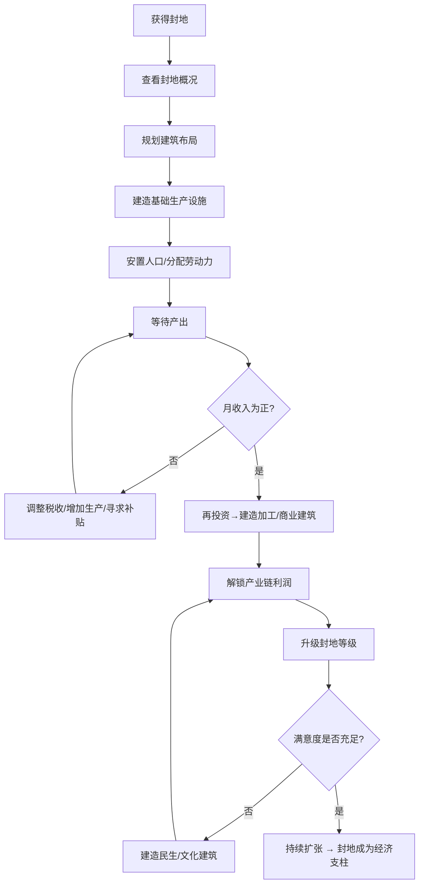

# 封地经济

## 设计目标

> 对标《凯撒大帝》的城市规划乐趣 + 《太阁立志传5》的封地管理深度。玩家的封地不是摆设，而是收入、兵源和声望的基础。

## 系统概述

当玩家获得爵位后，将获封相应规模的封地。封地是玩家的个人领地，独立于国家体系运营。玩家可进行城市规划、建造建筑、管理人口、征收赋税。封地经济状况直接影响玩家的军事实力和政治地位。此系统仅在玩家拥有封地时开放。

## 核心机制

### 3.1 封地规模与爵位对应

| 爵位 | 封地规模 | 最大建筑位 | 最大人口 | 可驻军 |
|------|---------|-----------|---------|--------|
| Lv1 士 | 无封地 | — | — | — |
| Lv2 大夫 | 村庄×1 | 8 | 500 | 50人 |
| Lv3 下卿 | 村庄×3 | 20 | 2000 | 200人 |
| Lv4 中卿 | 县城×1 | 35 | 5000 | 500人 |
| Lv5 上卿 | 县城×2 | 50 | 12000 | 1500人 |
| Lv6 关内侯 | 郡城×1 | 70 | 30000 | 5000人 |
| Lv7 列侯 | 郡城×3 | 100 | 80000 | 15000人 |
| Lv8 王 | 全国 | — | — | 全国兵力 |
| Lv9 帝 | 天下 | — | — | 天下兵马 |

### 3.2 封地建设（凯撒式城市规划）

#### 建设模式

进入建设模式后切换俯视视角，在网格上放置建筑。建筑分为以下类别：

#### 生产建筑

| 建筑 | 占地(格) | 建造成本(金) | 建造时间(天) | 月维护(金) | 产出/月 |
|------|---------|-------------|-------------|-----------|---------|
| 农田 | 4×4 | 500 | 15 | 50 | 粮食50石 |
| 伐木场 | 2×2 | 300 | 10 | 30 | 木材30石 |
| 采石场 | 2×2 | 400 | 12 | 40 | 石材25石 |
| 铁矿场 | 3×3 | 800 | 20 | 100 | 铁矿石15石 |
| 马场 | 5×5 | 1500 | 30 | 200 | 战马5匹 |
| 渔场 | 2×2 | 200 | 7 | 20 | 鱼30石 |
| 牧场 | 3×3 | 500 | 15 | 50 | 肉20石+皮革5张 |

#### 加工建筑

| 建筑 | 占地(格) | 建造成本(金) | 建造时间(天) | 月维护(金) | 功能 |
|------|---------|-------------|-------------|-----------|------|
| 冶铁坊 | 2×2 | 1500 | 20 | 150 | 铁矿石→精铁 |
| 兵器坊 | 2×2 | 2000 | 25 | 200 | 精铁→兵器 |
| 制甲坊 | 3×3 | 2500 | 30 | 250 | 精铁+皮革→铁甲 |
| 制弓坊 | 2×2 | 1200 | 15 | 100 | 木材+皮革→弓/弩 |
| 纺织坊 | 2×2 | 800 | 15 | 60 | 丝绸/布帛 |
| 酿酒坊 | 2×2 | 600 | 12 | 50 | 粮食→酒 |
| 制盐坊 | 2×2 | 600 | 15 | 50 | 盐精制 |
| 陶瓷坊 | 2×2 | 700 | 15 | 60 | 黏土→陶器 |

#### 商业建筑

| 建筑 | 占地(格) | 建造成本(金) | 建造时间(天) | 月维护(金) | 收入/月 |
|------|---------|-------------|-------------|-----------|---------|
| 市集 | 2×2 | 1000 | 10 | 50 | 商业税+100-300金 |
| 商铺 | 1×1 | 500 | 7 | 20 | 租金+30-80金 |
| 仓库 | 2×2 | 300 | 10 | 10 | 货物储存+200石 |
| 驿站 | 1×1 | 400 | 7 | 30 | 商队效率+15% |
| 钱庄 | 1×1 | 2000 | 15 | 100 | 贷款利率+5%,存储金生息 |

#### 军事建筑

| 建筑 | 占地(格) | 建造成本(金) | 建造时间(天) | 月维护(金) | 功能 |
|------|---------|-------------|-------------|-----------|------|
| 兵营 | 3×3 | 1500 | 20 | 200 | 训练士兵/驻军+200 |
| 训练场 | 3×3 | 1000 | 15 | 100 | 士兵经验成长+20% |
| 武库 | 2×2 | 2000 | 25 | 150 | 武器存储+500件 |
| 马厩 | 3×3 | 1200 | 15 | 150 | 战马饲养+存储 |
| 箭塔 | 1×1 | 500 | 10 | 30 | 防御射击(3格范围) |
| 城墙 | 边线 | 500/格 | 30/段 | 20/段 | 防御+20%/段 |

#### 民生建筑

| 建筑 | 占地(格) | 建造成本(金) | 建造时间(天) | 月维护(金) | 效果 |
|------|---------|-------------|-------------|-----------|------|
| 民居 | 1×1 | 100 | 5 | 0(租户自付) | 人口容量+10,租金+5金/月 |
| 水井 | 1×1 | 150 | 5 | 5 | 居民满意度+5 |
| 医馆 | 1×1 | 500 | 10 | 50 | 居民健康+10%,瘟疫概率-30% |
| 学堂 | 2×2 | 800 | 20 | 80 | 科技研发速度+5%,人才出现率+ |
| 粮仓 | 2×2 | 400 | 10 | 20 | 粮食存储+500石,抗灾荒 |
| 祠堂 | 1×1 | 300 | 10 | 15 | 民忠+5 |
| 刑场/官衙 | 2×2 | 600 | 15 | 60 | 治安+10,犯罪率- |

#### 文化建筑

| 建筑 | 占地(格) | 建造成本(金) | 建造时间(天) | 月维护(金) | 效果 |
|------|---------|-------------|-------------|-----------|------|
| 学宫 | 4×4 | 3000 | 45 | 300 | 吸引学者,科技研发+15% |
| 乐坊 | 2×2 | 1000 | 15 | 80 | 居民满意度+10,魅力+ |
| 园林 | 3×3 | 1500 | 20 | 60 | 居民满意度+8,来访NPC好感+ |

### 3.3 人口系统

#### 人口属性

```
封地人口 = 农民 + 工匠 + 商人 + 士兵 + 士人 + 其他

农民：基础劳动力，在农田/牧场工作
工匠：在加工作坊工作，需要学堂/学宫吸引
商人：在市集/商铺工作，自动从事贸易
士兵：驻军，不从事生产
士人：文化/管理人口，需要学宫吸引
其他：老幼/无业(治安隐患)
```

#### 人口增长

```
月人口增长率 = 基础增长率 + 满意度修正 + 建筑修正 + 事件修正

基础增长率：0.5%/月（和平时期）
满意度修正：(满意度 - 50) / 100 × 0.3%
建筑修正：每栋民居 +0.1%/月
事件修正：饥荒 -2%/月 | 瘟疫 -10%/月 | 节日 +1%/月
```

#### 劳动力分配

```
可用劳动力 = 总人口 × 劳动参与率(约60%)

每个生产建筑需要：
农田：2-5人
作坊：1-3人
商业建筑：1-2人

劳动力不足 → 建筑产出/收入下降
劳动力过剩 → 无业人口→犯罪率↑→治安↓
```

### 3.4 税收与财政

#### 税收类型

| 税种 | 税基 | 基础税率 | 可调范围 | 影响 |
|------|------|---------|---------|------|
| 田赋 | 农业产出 | 10% | 5-30% | 税率↑→民忠↓ |
| 商税 | 商业收入 | 5% | 3-20% | 税率↑→商人流失 |
| 户税 | 每户人口 | 2金/户/月 | 1-5金 | 税率↑→人口迁出 |
| 关税 | 过境商品 | 3% | 1-15% | 税率↑→商路绕行 |
| 徭役 | 劳动力 | 10天/年 | 5-30天 | 天数↑→民忠↓+工程加速 |

#### 月收支计算

```
月收入 = 田赋收入 + 商税收入 + 户税收入 + 关税收入 + 商铺租金 + 资源贩卖
月支出 = 建筑维护 + 驻军军饷 + 官员俸禄 + 工程支出 + 进贡/税收上缴

净收入 = 月收入 - 月支出

净收入为负 → 需要玩家从其他渠道补贴(贸易/战斗掠夺)
```

### 3.5 居民满意度（凯撒式指标）

```
满意度 = (食物充足度 × 0.3 + 就业率 × 0.2 + 安全度 × 0.15 + 税收负担 × 0.15 + 
          文化设施 × 0.1 + 健康度 × 0.1)

各指标计算：
食物充足度：粮食储备 / (人口 × 每人月消耗) × 100 (上限100)
就业率：有工作人口 / 劳动力人口 × 100
安全度：(100 - 犯罪率) × 治安建筑修正
税收负担：(100 - 总税率%)
文化设施：文化建筑覆盖 / 人口需要 × 100
健康度：医馆覆盖 + 基础健康 - 环境污染
```

#### 满意度效果

| 满意度 | 人口迁入/出 | 税收效率 | 叛乱概率 | NPC态度 |
|--------|------------|---------|---------|---------|
| 90-100 | +5%/月迁入 | 110% | 0% | 居民送礼物 |
| 70-89 | +1%/月迁入 | 100% | 0% | 居民夸赞 |
| 50-69 | 持平 | 95% | 0% | 正常 |
| 30-49 | -1%/月迁出 | 80% | 5%/月 | 偶有抱怨 |
| 10-29 | -3%/月迁出 | 60% | 15%/月 | 公开不满 |
| 0-9 | -5%/月迁出 | 30% | 40%/月 | 爆发叛乱 |

### 3.6 封地升级

```
村庄：人口<2000，建筑位<20，无城墙
    ↓ 条件：人口达到1500，满意度>60，投资5000金
乡镇：人口2000-5000，建筑位<50，可建木栅
    ↓ 条件：人口达到4000，满意度>60，投资20000金
县城：人口5000-15000，建筑位<70，可建石墙
    ↓ 条件：人口达到12000，满意度>70，投资80000金
郡城：人口15000+，建筑位<100，可建砖墙+瓮城
```

## 玩家流程



## 经营属性对封地的影响

```
经营属性每10点：

产出效率 +3%
税收效率 +2%
建筑建造时间 -3%
劳动力需求 -2%
满意度基础值 +1

经营≥60：可任命"封地总管"代为管理（AI托管）
经营≥80：解锁"封地政策"系统（特殊BUFF）
经营≥100：解锁"连锁经营"（相邻同类型建筑产出+15%）
```

## 与其他系统的交互

| 关联系统 | 交互方式 | 影响 |
|---------|---------|------|
| 资源产业链 | 生产/加工建筑在封地中建造 | 封地是生产的基础平台 |
| 贸易系统 | 封地产出可供给商队/卖给商贩 | 封地是贸易的供货源 |
| 战斗系统 | 封地提供兵源/粮草/装备 | 封地经济=军事上限 |
| 爵位系统 | 爵位决定封地规模上限 | 爵位与封地捆绑 |
| 科技系统 | 科技解锁新建筑类型 | 科技→新产业→新收入 |

## 数值范围

| 参数 | 最小值 | 默认值 | 最大值 | 说明 |
|------|--------|--------|--------|------|
| 封地净利润/月 | -500 | 200-500(Village) | 50000+(郡城) | 受规模和经营影响 |
| 建筑建造时间 | 5天 | 15天 | 45天 | 学宫最久 |
| 人口上限 | 500 | — | 80000 | 爵位决定 |
| 建筑总位 | 8 | — | 100 | 爵位决定 |

## 变更日志

| 版本 | 日期 | 变更内容 | 作者 |
|------|------|---------|------|
| v1.0 | 2026-07-15 | 初稿 | 策划-经济 |
