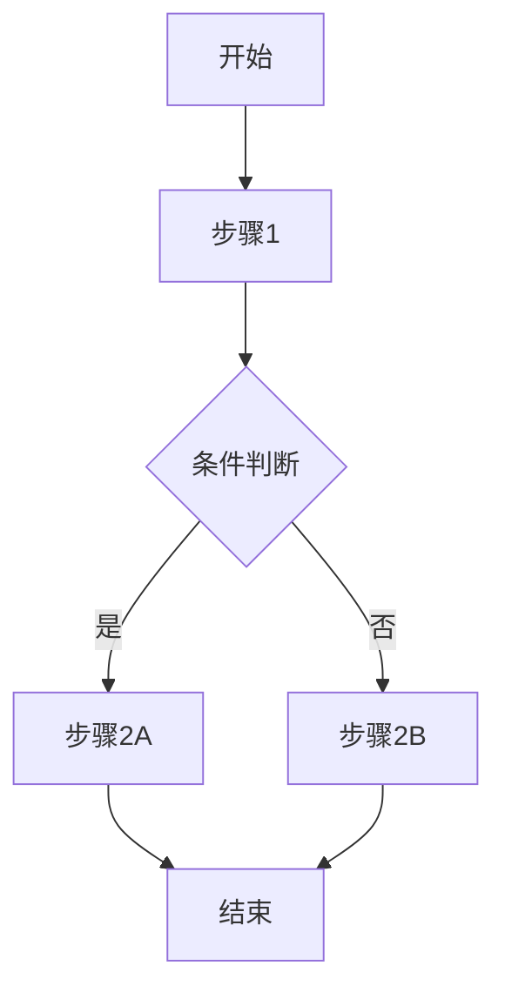

# [系统名称]

## 1. 设计目标

> 用1-2句话描述这个系统要解决什么问题、给玩家什么体验。

示例：战斗系统的设计目标是让玩家感受到"一刀一刀砍出来的胜利"，
      而非数值对撞。对标《骑马与砍杀2》的手感。

## 2. 系统概述

[一段话概述系统全貌，包含核心循环和主要交互方式]

## 3. 核心机制

### 3.1 [子机制1]

[详细描述，包含：]
- 规则
- 触发条件
- 参数与公式
- 视觉/音频反馈

### 3.2 [子机制2]

[同上]

## 4. 玩家流程

## 5. 与其他系统的交互

| 关联系统 | 交互方式 | 影响 |
|---------|---------|------|
| [系统A] | [描述] | [描述] |
| [系统B] | [描述] | [描述] |

## 6. UI/UX 需求

- [ ] UI面板：[描述需要什么样的界面]
- [ ] 交互方式：[玩家如何操作]
- [ ] 视觉反馈：[需要什么样的视觉提示]
- [ ] 音频反馈：[需要什么样的音效]

## 7. 数值范围

| 参数 | 最小值 | 默认值 | 最大值 | 说明 |
|------|--------|--------|--------|------|
| [参数1] | | | | |
| [参数2] | | | | |

## 8. 技术要求

- [ ] 需要新 DataTable：[表名]
- [ ] 需要新 Blueprint/C++ 类：[类名]
- [ ] 需要新 UI Widget：[Widget名]
- [ ] 需要新动画：[动画名]
- [ ] 需要新音效：[音效名]
- [ ] 性能关注点：[描述]

## 9. 参考

- 参考游戏：[游戏名]的[功能名]
- 参考视频/截图：[链接]
- 历史考据：[来源]

## 10. 开放问题

- [ ] [需要进一步讨论的问题]
- [ ] [需要验证的假设]

## 变更日志

| 版本 | 日期 | 变更内容 | 作者 |
|------|------|---------|------|
| v0.1 | [日期] | 初稿 | [作者] |
